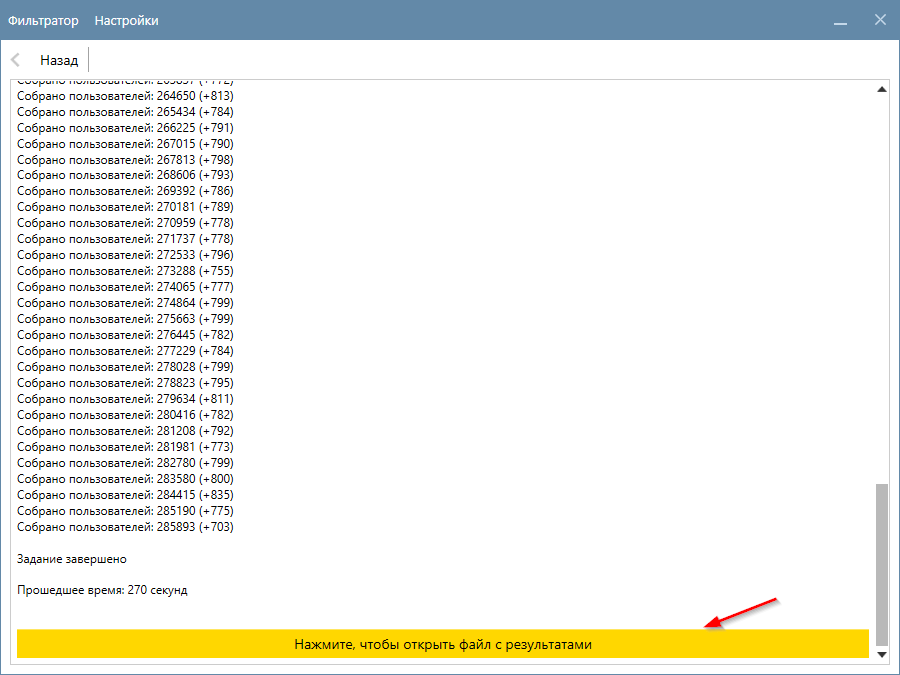

# Релиз версии 2.0.255

__В этой версии мы улучшили юзабилити программы.__

В прошлых версиях после работы функции вам необходимо было самим открывать папку с проектом и переходить в папку с файлами функции, чтобы ознакомиться с результатами. Мы понимаем, что это неудобно и поэтому в этом обновлении мы упростили этот процесс. 

После того как функция отработала в окне с прогрессом появится кнопка. По нажатию на неё вы сразу перейдете к результатам.

<figure markdown>
  
  <figcaption></figcaption>
</figure>

Если результат работы это один файл — то по нажатию на кнопку программа откроет этот файл. Если же результат работы функции это несколько файлов — то программа откроет папку с этими файлами.

<!-- more -->
