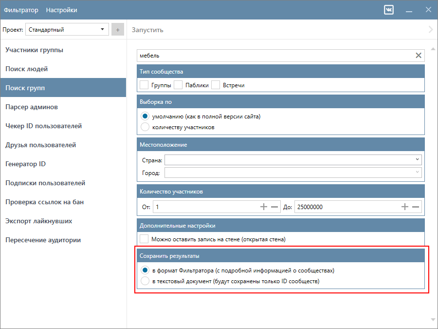
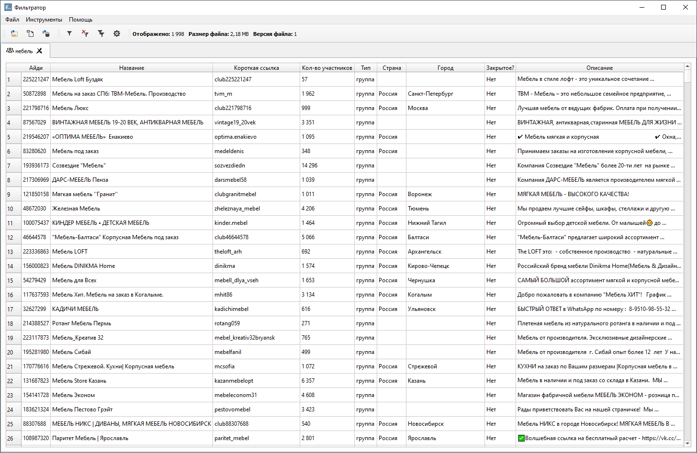
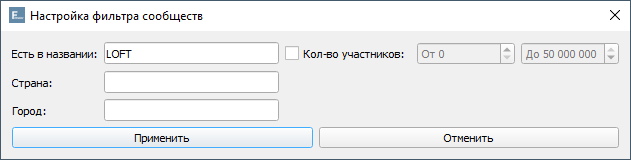
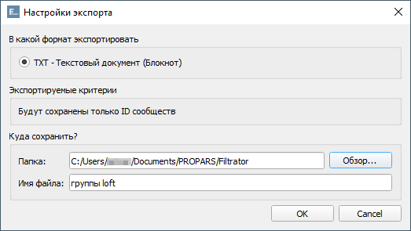

# Релиз версии 2.0.258

__Теперь мы сохраняем сообщества в формат Фильтратора с подробной информацией, включая ID, название, страну, город, описание и др. Этот формат позволит вам легко фильтровать группы по различным параметрам прямо в Фильтраторе.__

Для этого в функции "Поиск групп" мы добавили следующую опцию:

По умолчанию найденные сообщества будут сохранены в формат Фильтратора. Если вам нужны только ID найденных сообществ — вы можете сразу сохранить их в TXT.

Работа с сообществами ничем не отличается от работы с файлами пользователей. Вот как это выглядит:

Как и в случае с пользователями, вы можете отфильтровать сообщества. Для этого откройте окно <code>Настройки фильтра</code> с помощью горячих клавиш <kbd>Ctrl</kbd> + <kbd>F</kbd>, либо через меню приложения <code>Инструменты -> Установить фильтр</code>.

Затем вы можете экспортировать ID сообществ в текстовый файл. 

В будущих версиях мы планируем добавить:

- экспорт в CSV файл со всей подробной информацией
- фильтр по ключевым словам из описания.
