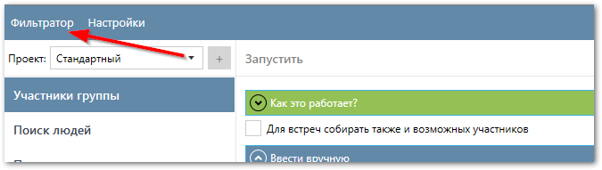
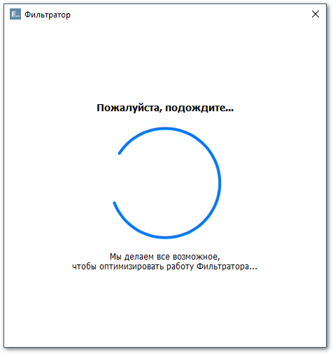
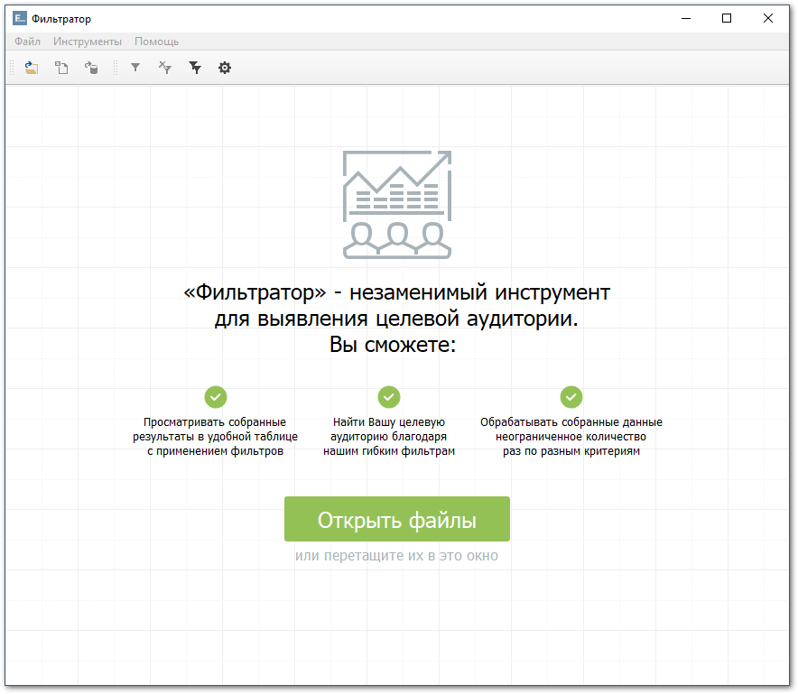

Чтобы запустить Фильтратор нажмите на кнопку `Фильтратор` в левом верхнем углу Парсера.

<!-- Начнется запуск Фильтратора, который занимает :octicons-clock-24: пару секунд.

 -->

После чего вы увидите главное окно Фильтратора.

