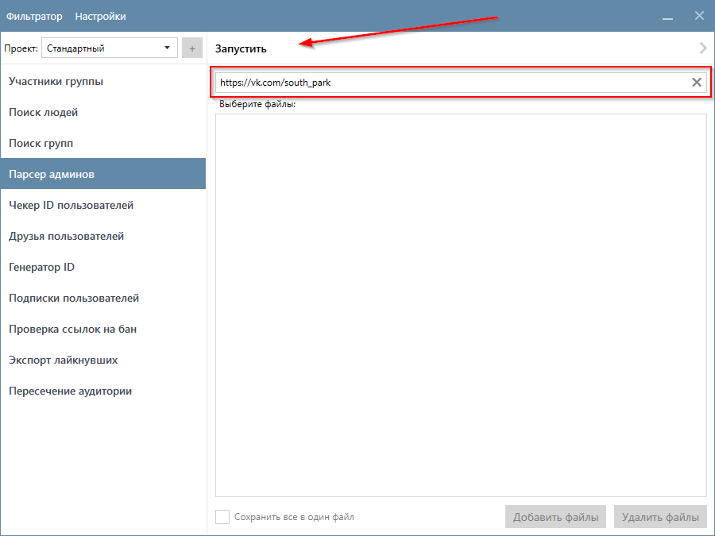
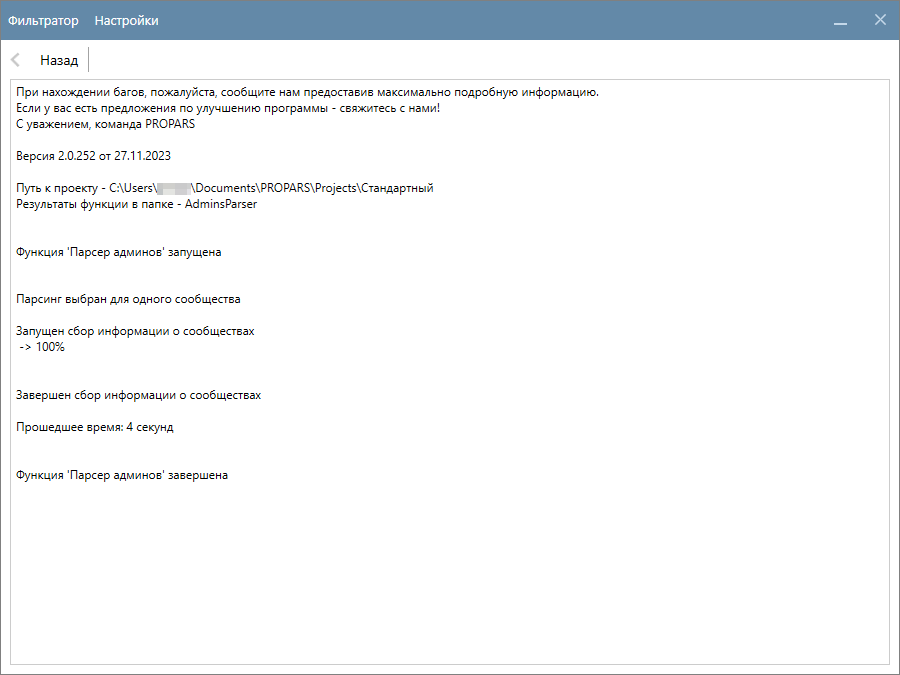
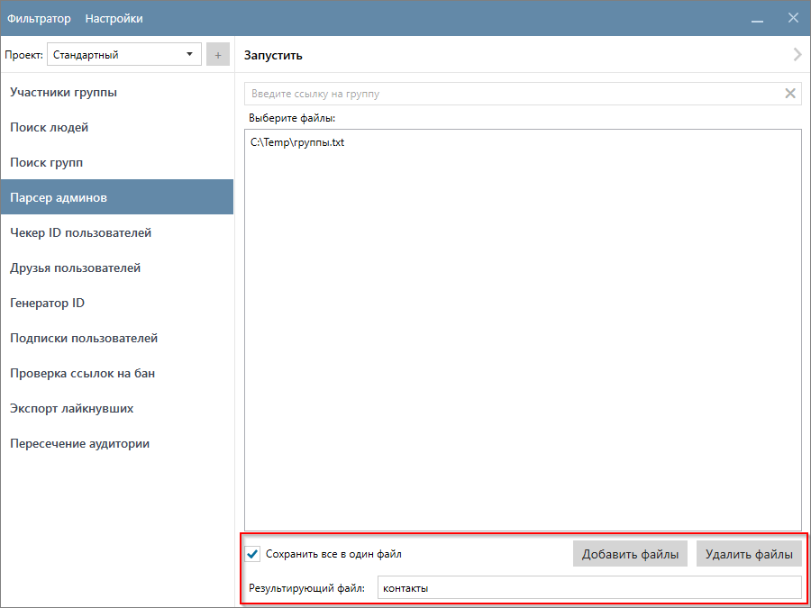
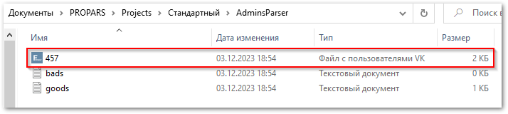
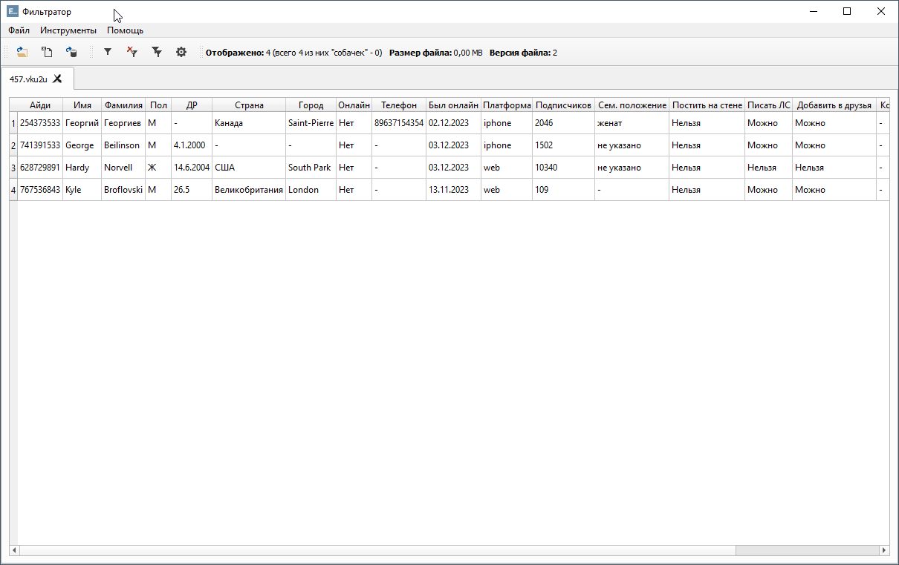

# Парсер админов

  

    Эта функция предназначена для сбора данных о пользователях сообщества, указанных в разделе <code>Контакты</code>.
  

??? question "Какие данные о пользователях собирает функция?"
    Это зависит от ваших настроек. Для получения подробной информации, ознакомьтесь с разделом [Настройка Парсера](./index.md#settings).

## Пример запуска функции

  

    Функция поддерживает два способа запуска:
  

  <ul>
    <li>Ручной ввод - подходит только для одного сообщества; </li>
    <li>Выбор файлов - используется в случае, если сообществ несколько.</li>

  

    Программа принимает ссылки, айди и короткие имена. В файле каждое сообщество должно быть указано с новой строки. Подробнее о формате входных данных <a href="../#txt-format">можно узнать здесь</a>.
  

  

    В данном примере мы запустим функцию с помощью "ручного ввода". Просто укажите сообщество, контакты которого необходимо собрать, и нажмите кнопку "Запустить".
  

  

    Парсер начнет собирать информацию о контактах в указанных вами сообществах. Этот процесс может занять некоторое время (в нашем примере, 4 секунды).
  

## Куда сохраняются результаты?

  

    Результаты сохраняются в <code>(Папка проекта)\AdminsParser</code>. Имя файла соответствует идентификатору (<code>ID</code>) сообщества.  
  

??? info "Если в качестве входных данных вы выбрали файл(ы), то для вашего удобства есть возможность сохранить результаты в один файл."
    

      

        Для этого установите флажок <code>Сохранить всё в один файл</code> и укажите имя файла.
      

    

    

  

    В данном примере мы указали всего одно сообщество, поэтому результаты будут сохранены в один файл.
  

  

    Вы можете открыть файл и ознакомиться с результатами в Фильтраторе.
  

---

!!! success "Спасибо, что дочитали до конца. Остались вопросы? <a href="../../../support">Свяжитесь с нами!</a>"