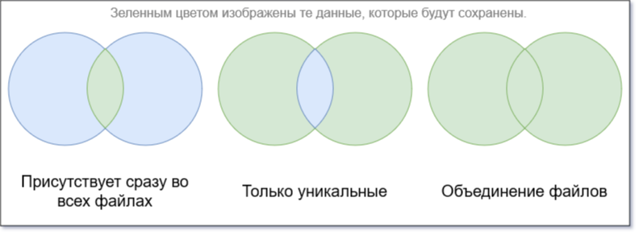
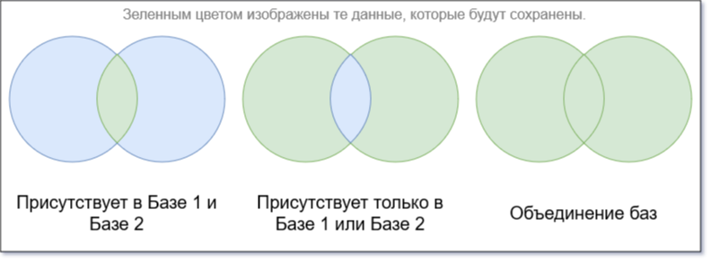
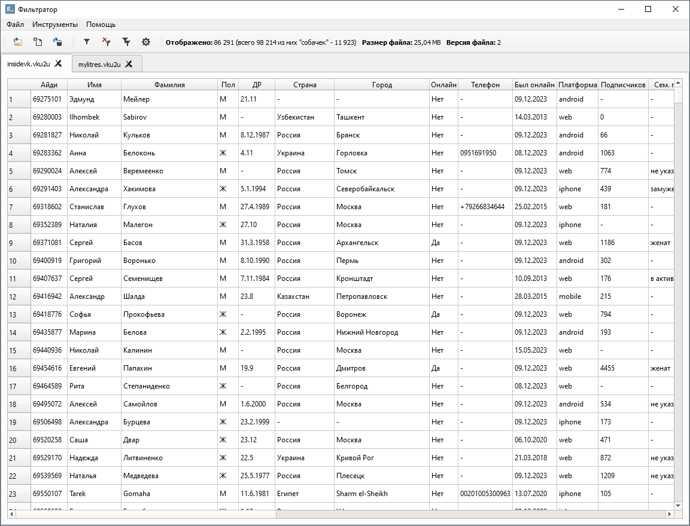
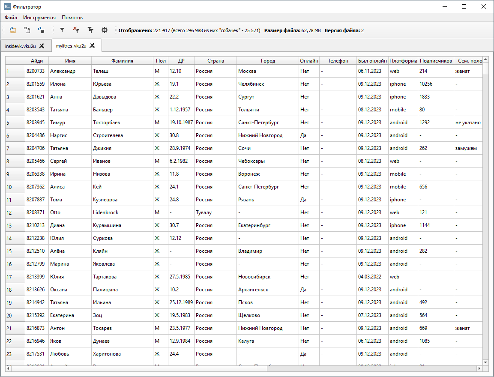
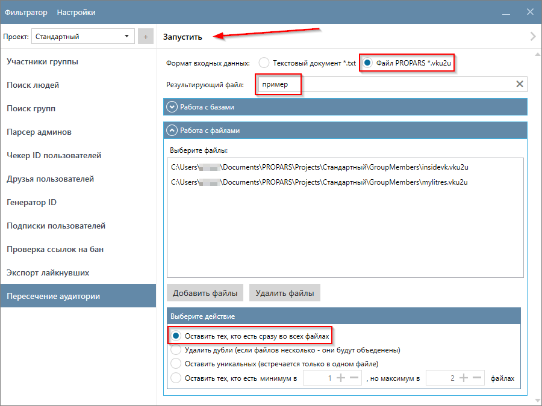
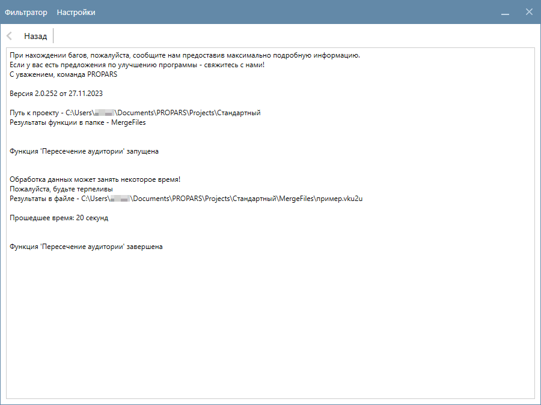
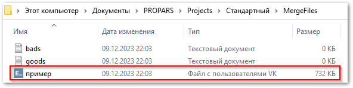
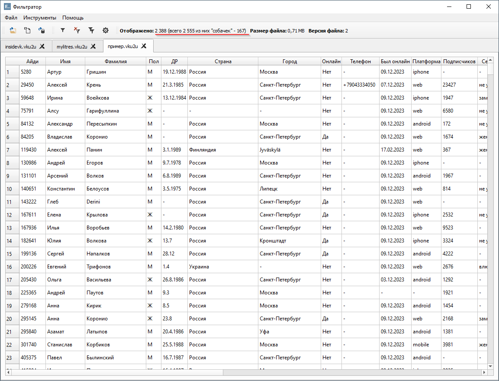

# Пересечение аудитории

  

    Данная функция поможет вам в более точном 🎯 выявлении вашей ЦА. Хотите оставить только тех пользователей, которые присутствуют сразу во всех сообществах? Или хотя бы в двух сообществах из четырёх? Или, наоборот, только уникальных (пользователь состоит только в одном из сообществ)? В таком случае функция <code>Пересечение аудитории</code> – ваш незаменимый помощник.
  

  

    Функция работает в двух режимах – режим работы с файлами и режим работы с базами. Умеет работать как с текстовыми файлами, так и с файлами формата <code>VKU</code>.
  

---

## Режим работы с файлами

  

    В режиме работы с файлами вы можете:
  

  <ul class="styled">
    <li>Оставить тех, кто присутствует сразу во всех файлах;</li>
    <li>Оставить только уникальных (присутствует только в одном из файлов);</li>
    <li>Оставить тех, кто присутствует в указанном количестве файлов (от и до);</li>
    <li>Объединить файлы в один файл (дубли будут удалены, т.е. каждый пользователь будет встречаться только один раз).</li>
  </ul>
  

    На картинке ниже мы изобразили, что означает каждое из действий на примере двух файлов. В случае с бо́льшим количеством файлов смысл тот же, но для простоты диаграммы мы изобразили именно два файла.
  

  

    Во всех случаях в результирующем файле каждый из пользователей будет встречаться только один раз, другими словами – дублей не будет.
  

---

## Режим работы с базами

  

    В тоже время, режим работы с базами позволяет вам:
  

  <ul class="styled">
    <li>Оставить тех, кто присутствует в обеих базах одновременно;</li>
    <li>Объединить базы (дубли будут удалены);</li>
    <li>Оставить только уникальных (встречается только в одной из баз).</li>
  </ul>

  

    Что из себя представляет <code>База</code>? По сути это набор файлов с пользователями. Вы выбираете файлы для первой базы и файлы для второй базы соответственно. Далее применяется таже логика, что и для режима работы с файлами.
  

---

## Когда и какой режим использовать?

  

    Это, конечно, зависит от ваших целей. Мы приведём два простых примера, чтобы вам было понятнее.
  

### Когда использовать режим работы с файлами?

  

    Вы собрали участников из 20 сообществ с котиками. Теперь вы хотите оставить только тех пользователей, которые очень сильно любят котиков. В таком случае в режиме работы с файлами вы добавляете все файлы с участниками соответствующих сообществ. Выбираете <code>Оставить тех, кто есть сразу во всех файлах</code>, либо <code>Оставить тех, кто есть минимум в 10, но максимум в 20 файлах</code>. Всё, на выходе вы получите настоящих ценителей котиков!
  

### Когда использовать режим работы с базами?

  

    Вы собрали участников из 20 сообществ с котиками, а также участников из 30 сообществ с собачками. И теперь вы хотите оставить тех пользователей, кто интересуется и котиками, и собачками. В режиме работы с базами добавьте в первую базу участников из сообществ с котиками, а во вторую участников из сообществ с собачками. Выберите <code>Оставить тех, кто есть одновременно в Базе 1 и Базе 2</code>. На выходе вы получите тех, кто любит как котиков, так и собачек.
  

---

## Пример запуска

  

    Для этого примера мы подготовили два файла формата <code>VKU</code> с пользователями. Каждый из файлов содержит участников двух разных сообществ, которых мы собрали с помощью функции <a href="../group-members">Участники группы</a>. Давайте оставим только тех пользователей, которые состоят в обеих группах.
  

=== "Первое сообщество"
    

      

        В первом сообществе <code>98,214</code> пользователей.
      

    

    

=== "Второе сообщество"
    

      

        Во втором сообществе <code>246,998</code> пользователей.
      

    

    

  

    Выберите вкладку <code>Пересечение аудитории</code> в Парсере и укажите настройки для запуска:
  

  <ul>
    <li>Формат входных данных – <code>Файл PROPARS</code> для работы с файлами формата <code>VKU</code>;</li>
    <li>Результирующий файл – эта настройка задает имя файла, в который будут сохранены результаты;</li>
    <li>В разделе <code>Работа с файлами</code> выберите файлы с пользователями. В этом примере мы выбрали два файла;</li>
    <li>В качестве действия выберите <code>Оставить тех, кто есть сразу во всех файлах</code>.</li>
  </ul>
  

    Настройки для функции сделаны. Запустим функцию нажав на кнопку <code>Запустить</code>.
  

  

    Начнётся обработка данных, она займет некоторое время (в нашем примере – <b>20 секунд</b>).
  

## Куда сохраняются результаты?

  

    Результаты сохраняются в <code>(Папка проекта)\MergeFiles</code>. Имя файла – то, которое вы указали в настройках функции.
  

  

    По двойному щелчку вы можете открыть файл и ознакомиться с результатами в Фильтраторе. 
  

  

    Из <code>345,212</code> в обеих группах состоит только <code>2,555</code> пользователей.
  

---

!!! success "Спасибо, что дочитали до конца. Остались вопросы? <a href="../../../support">Свяжитесь с нами!</a>"