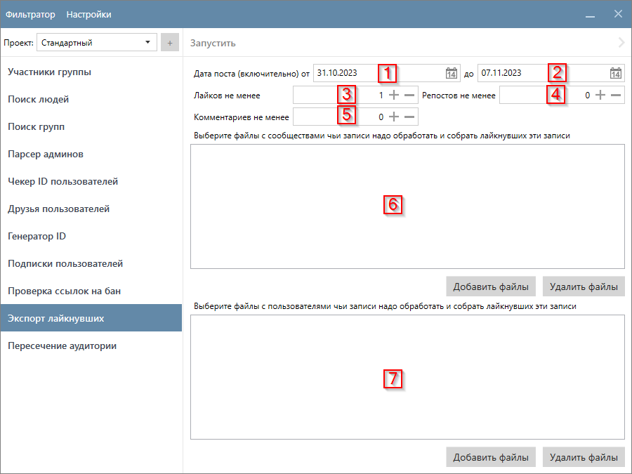

# Экспорт лайкнувших

Функция собирает пользователей, которые поставили лайк записям на стене указанных сообществ и/или пользователей.

Результаты сохраняются в `(Папка проекта)\(ExportLikes)`.

!!! warning "То, какие данные о пользователях собирает функция, зависит от ваших настроек. [Подробнее здесь](../parser/404.md)."

## Интерфейс функции

## Настройки функции

!!! info "Таблица ссылается на скриншот из предыдущего раздела"
    

<table >
  <thead>
    <tr style="background-color:rgb(241, 242, 244)">
      <th style="width:30%">Название</th>
      <th style="width:5%">№</th>
      <th style="width:65%">Описание</th>
    </tr>
  </thead>
  <tbody>
    <tr>
      <td>Дата записи</td>
      <td>1, 2</td>
      <td>Период когда запись на стене была сделана.</td>
    </tr>
    <tr>
      <td>Лайков не менее</td>
      <td>3</td>
      <td>Минимальное количество лайков на записи. Нельзя установить значение меньше, чем <code>1</code>.</td>
    </tr>
    <tr>
      <td>Репостов не менее</td>
      <td>4</td>
      <td>Минимальное количество репостов записи.</td>
    </tr>
    <tr>
      <td>Комментариев не менее</td>
      <td>5</td>
      <td>Минимальное количество комментариев к записи.</td>
    </tr>
    <tr>
      <td>Файлы с сообществами</td>
      <td>6</td>
      <td>Файлы с сообществами чьи записи необходимо обработать. Формат: <code>txt</code>. Подробнее о формате файла вы можете прочитать на <a href="../search-people#vk-1000">соответствующей странице</a>.</td>
    </tr>
    <tr>
      <td>Файлы с пользователями</td>
      <td>7</td>
      <td>Файлы с пользователями чьи записи необходимо обработать. Формат: <code>txt</code> и <code>vku2u</code>. Подробнее о формате файла вы можете прочитать на <a href="../search-people#vk-1000">соответствующей странице</a>.</td>
    </tr>
  </tbody>
</table>