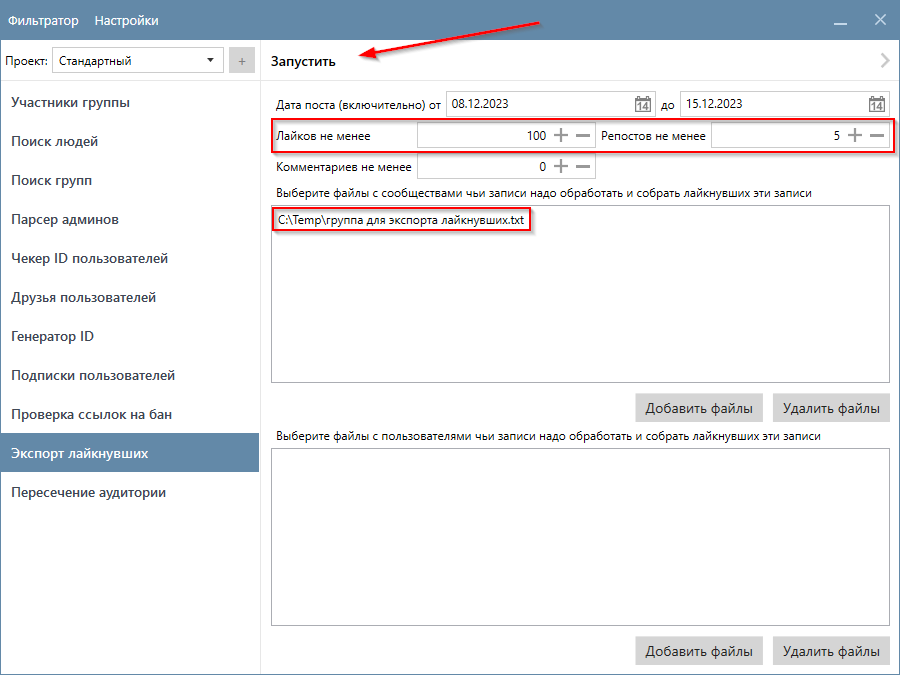
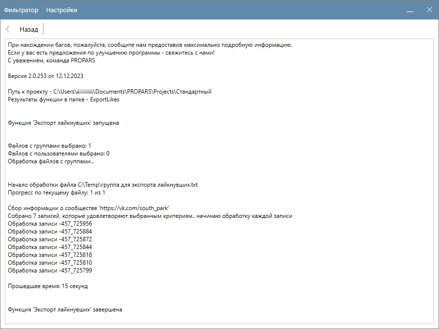
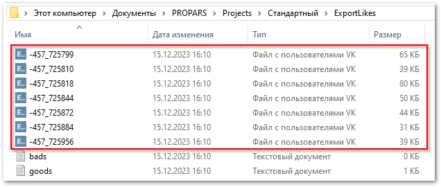
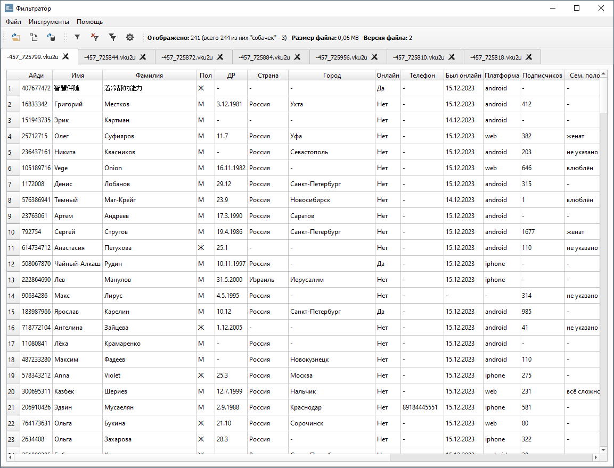
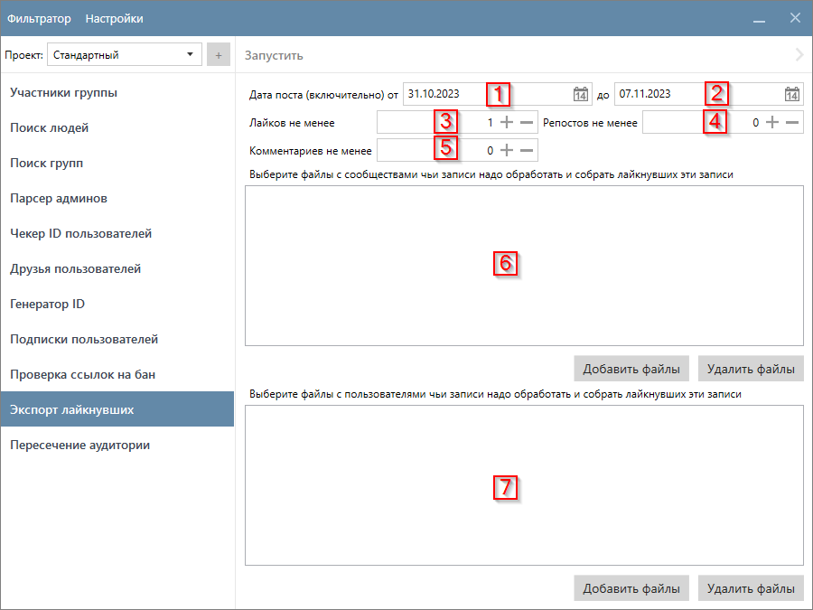

# Экспорт лайкнувших

  

    Функция собирает подробную информацию о пользователях, которые лайкнули записи на стене указанных сообществ и/или пользователей. Записи можно отфильтровать указав дату, когда запись была сделана, а также минимальное количество лайков, репостов и комментариев к записи.
  

??? question "Какие данные о пользователях собирает функция?"
    Это зависит от ваших настроек. Ознакомьтесь с разделом [Настройка Парсера](./index.md#settings).

## Пример запуска

  

    Для запуска функции нужно загрузить файлы с сообществами и/или пользователями, чьи записи необходимо проанализировать и собрать лайкнувших. Сообщества и пользователи загружаются из текстовых файлов с расширением <code>.txt</code>. Для пользователей поддерживаются также файлы формата <code>VKU</code>. Подробнее про формат входных данных <a href="../#txt-format">вы можете прочитать здесь</a>.
  

  

    В данном примере мы будем работать с записями группы. Перейдите на вкладку <code>Экспорт лайкнувших</code>, добавьте файлы с сообществами и укажите следующие настройки:
  

  <ul>
    <li>Дата поста — по умолчанию последняя неделя. Так и оставим;</li>
    <li>Лайков не менее — 100;</li>
    <li>Репостов не менее — 5.</li>
  </ul>
  

    После чего нажмите кнопку <code>Запустить</code> в верхней части окна программы.
  

!!! info "В нашем примере файл содержит только одно сообщество — <code>https://vk.com/south_park</code>."

  

    Программа начнет анализировать записи выбранных сообществ. Для тех записей, которые удовлетворяют выбраннм настройкам, будет собрана подробная информация о пользователях, которые эти записи лайкнули. В этом примере это заняло <b>15</b> секунд.
  

## Куда сохраняются результаты?

  

    Результаты сохраняются в <code>(Папка проекта)\ExportLikes</code>. Для каждой записи будет создан отдельный файл формата <code>VKU</code> с пользователями, которые лайкнули эту запись. Имя файла — <code>-&lt;ID сообщества&gt;_&lt;ID записи&gt;</code>. В нашем примере программа нашла в сообществе семь записей, которые удовлетворяют указанному фильтру.
  

Откройте файлы в Фильтраторе, чтобы ознакомиться с результатами.

## Настройки функции

!!! info "Таблица ссылается на скриншот выше"
    

<table>
  <thead>
    <tr style="background-color:rgb(241, 242, 244)">
      <th style="width:30%">Название</th>
      <th style="width:5%">№</th>
      <th style="width:65%">Описание</th>
    </tr>
  </thead>
  <tbody>
    <tr>
      <td>Дата записи</td>
      <td>1, 2</td>
      <td>Период когда запись на стене была сделана.</td>
    </tr>
    <tr>
      <td>Лайков не менее</td>
      <td>3</td>
      <td>Минимальное количество лайков у записи. Нельзя установить значение меньше, чем <code>1</code>.</td>
    </tr>
    <tr>
      <td>Репостов не менее</td>
      <td>4</td>
      <td>Минимальное количество репостов записи.</td>
    </tr>
    <tr>
      <td>Комментариев не менее</td>
      <td>5</td>
      <td>Минимальное количество комментариев к записи.</td>
    </tr>
    <tr>
      <td>Файлы с сообществами</td>
      <td>6</td>
      <td>Файлы с сообществами чьи записи необходимо обработать. Формат: <code>txt</code>. Подробнее о формате файла вы можете прочитать на <a href="../#txt-format">соответствующей странице</a>.</td>
    </tr>
    <tr>
      <td>Файлы с пользователями</td>
      <td>7</td>
      <td>Файлы с пользователями чьи записи необходимо обработать. Формат: <code>txt</code> и <code>VKU</code>. Подробнее о формате файла вы можете прочитать на <a href="../#txt-format">соответствующей странице</a>.</td>
    </tr>
  </tbody>
</table>

!!! success "Спасибо, что дочитали до конца. Остались вопросы? <a href="../../../support">Свяжитесь с нами!</a>"