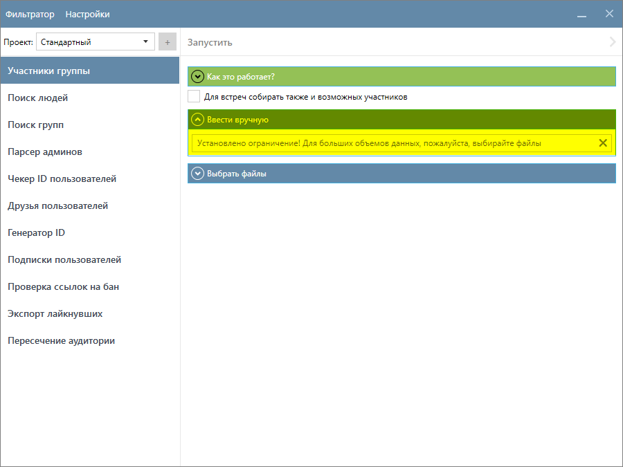
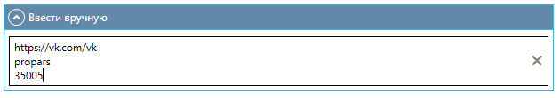
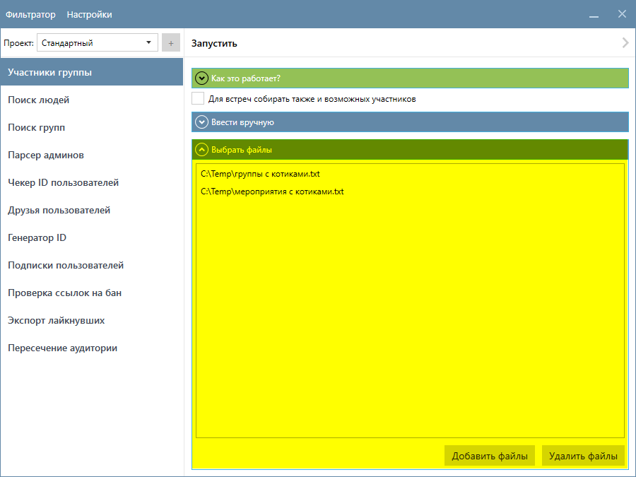
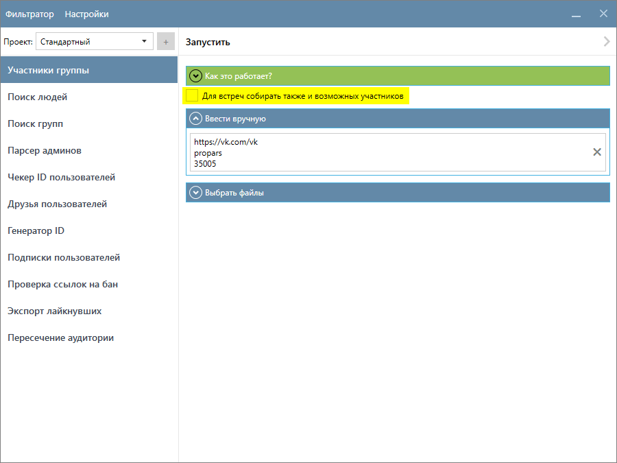

# Участники группы

Эта функция собирает участников групп, публичных страниц и мероприятий (включая возможных участников). Вы можете ввести названия сообществ вручную или загрузить файл(ы) со списком сообществ.

Результаты сохраняются в `(Папка проекта)\(GroupMembers)`.

??? question "Какие данные о пользователях собирает функция?"
    Это зависит от ваших настроек. Ознакомьтесь с разделом [Настройка Парсера](./index.md#settings).

## Ввод сообществ вручную

Этот режим является режимом по умолчанию и рекомендуется для небольших списков сообществ.  

Введите список сообществ в формате, где каждое сообщество начинается с новой строки, например:

## Выбор файлов

Вы также можете загрузить файлы со списком сообществ. Формат данных в файлах должен быть таким же, как при ручном вводе, где каждое сообщество начинается с новой строки. Поддерживаются только текстовые файлы с расширением `.txt`. Чтобы добавить файлы, используйте кнопку `Добавить файлы`. Если вам нужно удалить файлы из списка, выберите их и нажмите `Удалить файлы`.

## Настройки

Если в вашем списке сообществ есть Мероприятия и вы хотите собрать информацию о тех пользователях, кто выбрал `«Возможно пойду»`, то установите флажок `Для встреч собирать также и возможных участников`.

!!! success "Спасибо, что дочитали до конца. Остались вопросы? Напишите нам!"