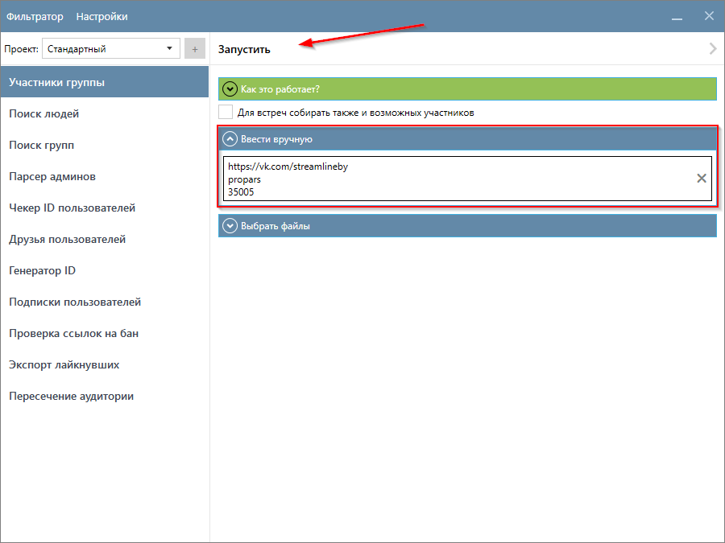
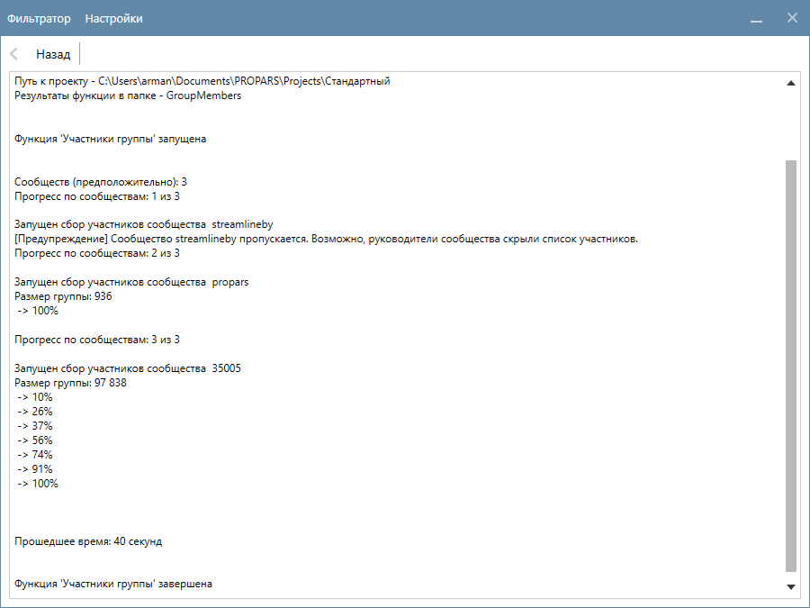
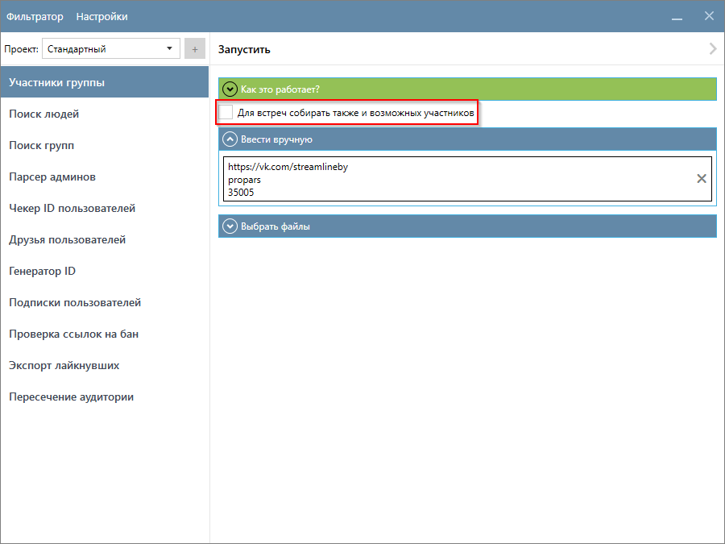
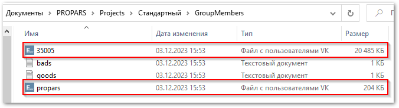
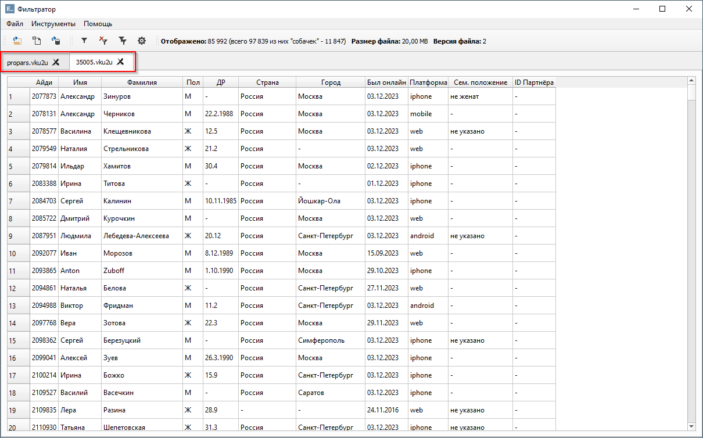

# Участники группы

  

    Функция собирает участников групп, публичных страниц и мероприятий (включая возможных участников). Вы можете ввести названия сообществ вручную или загрузить файл(ы) со списком сообществ.
  

??? question "Какие данные о пользователях собирает функция?"
    Это зависит от ваших настроек. Ознакомьтесь с разделом [Настройка Парсера](./index.md#settings).

## Пример запуска функции

  

    Функция поддерживает два способа запуска:
  

  <ul>
    <li>ручной ввод сообществ (рекомендуется для небольших списков сообществ) </li>
    <li>выбор файлов с сообществами</li>

  

    Каждое сообщество необходимо вводить с новой строки. Программа поддерживает ссылки, id, а также короткие имена. Подробнее про формат входных данных <a href="../#txt-format">вы можете прочитать здесь</a>.
  

  

    В данном примере мы запустим функцию с помощью ручного ввода. Укажите сообщества, чьих участников необходимо собрать, и нажмите кнопку <code>Запустить</code>.
  

  

    Парсер начнет собирать информацию. В нашем примере сбор занял 40 секунд.
  

!!! warning "Программа не сможет собрать участников сообщества, если администратор сообщества скрыл их. Для таких сообществ программа выведет предупреждение."

??? tip "Если в вашем списке сообществ есть Мероприятия и вы хотите собрать информацию о тех пользователях, кто выбрал `«Возможно пойду»`, то установите флажок `Для встреч собирать также и возможных участников`."
    

## Куда сохраняются результаты?

  

    Результаты вашей работы сохранятся в папке проекта <code>(Папка проекта)\(GroupMembers)</code>. Имя файла соответствует идентификатору сообщества, которое вы указали (<code>ID</code> или короткое имя). В нашем примере мы указали три сообщества для сбора данных, в одном из которых список участников был скрыт арминистратором, поэтому было создано два файла – каждый файл содержит информацию о участниках отдельного сообщества.
    Таким образом, для каждого указанного сообщества формируется отдельный файл, что обеспечивает структурированное хранение результатов вашей работы.
  

  

    По двойному щелчку вы можете открыть каждый из файлов и ознакомиться с результатами в Фильтраторе.
  

---

!!! success "Спасибо, что дочитали до конца. Остались вопросы? <a href="../../../support">Свяжитесь с нами!</a>"