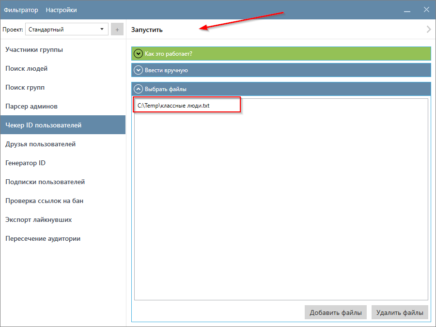
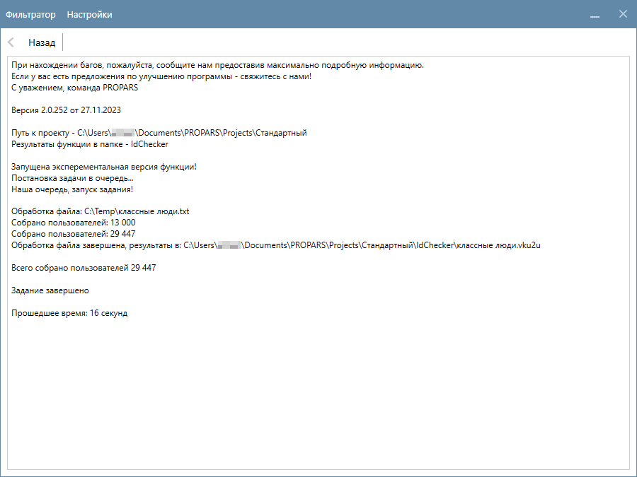
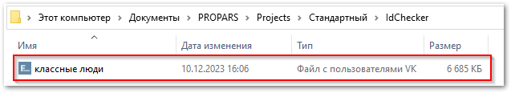
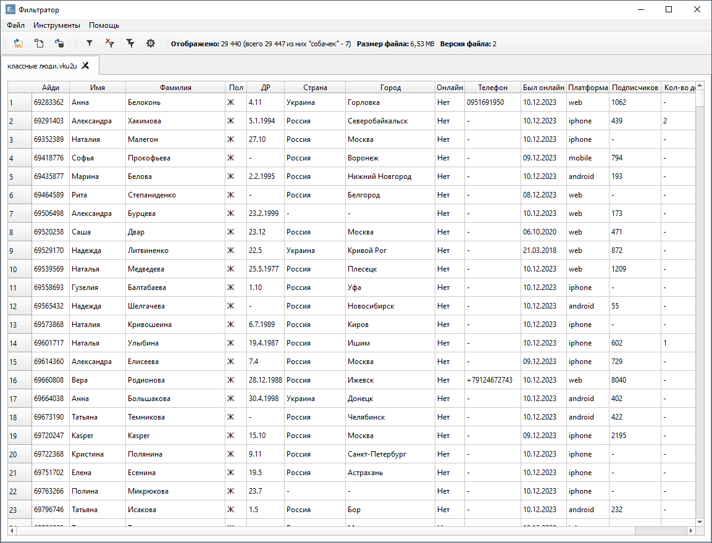

# Чекер ID пользоваталей

  

    Функция собирает подробную информацию о пользователях, которых вы загружаете в программу. У вас есть список людей и вы хотите собрать наиболее актуальную информацию о них? В таком случае функция <code>Чекер ID пользователей</code> – то, что вам нужно.
  

??? question "Какие данные о пользователях собирает функция?"
    Это зависит от ваших настроек. Ознакомьтесь с разделом [Настройка Парсера](./index.md#settings).

## Пример запуска функции

  

    Необходимо загрузить в программу пользователей, информацию о которых вы хотите собрать. Можно указать пользователей вручную или загрузить их из файлов. Программа поддерживает текстовые файлы с расширением <code>.txt</code>, а также файлы специального формата <code>VKU</code>.
    

    
   
 
    В данном примере мы будем собирать информацию о пользователях из текстового файла. Подробнее о формате входных данных <a href="../#txt-format">вы можете прочитать здесь</a>.
  

  
  

  Перейдите во вкладку <code>Чекер ID пользователей</code>, укажите файл с пользователями и нажмите кнопку <code>Запустить</code>.
  

  
    
    Парсер начнет собирать информацию о пользователях. В данном примере мы собрали около <code>30,000</code> пользователей, сбор данных занял 16 секунд.
  

## Куда сохраняются результаты?

  

    Результаты сохраняются в <code>(Папка проекта)\IdChecker</code> в файлы формата <code>VKU2U</code>.
  

??? info "Более подробно об именах файлов, в которые сохраняется собранная информация"
    

      

        Имя файла зависит от того, в каком режиме вы запустили функцию.
      

      

        Если список пользователей был введен вручную, то именем файла будет текущая дата и время. Например: <code>23-11-19_12.46.19.vku2u</code> (19 ноября 2023 года, 12 часов 46 минут 19 секунд).
      

      

        Если в качестве входных данных были выбраны файлы с пользователями, то имя результирующего файла соответствует имени входного файла. Например, если были выбраны файлы с именами: <code>мои_пользователи.txt</code> и <code>наши_пользователи.vku2u</code>, то результаты будут сохранены в <code>мои_пользователи<b>.vku2u</b></code> и <code>наши_пользователи.vku2u</code> соответственно. 
      

    

  

    Вы можете открыть файл и ознакомиться с результатами в Фильтраторе. 
  

---

!!! success "Спасибо, что дочитали до конца. Остались вопросы? <a href="../../../support">Свяжитесь с нами!</a>"