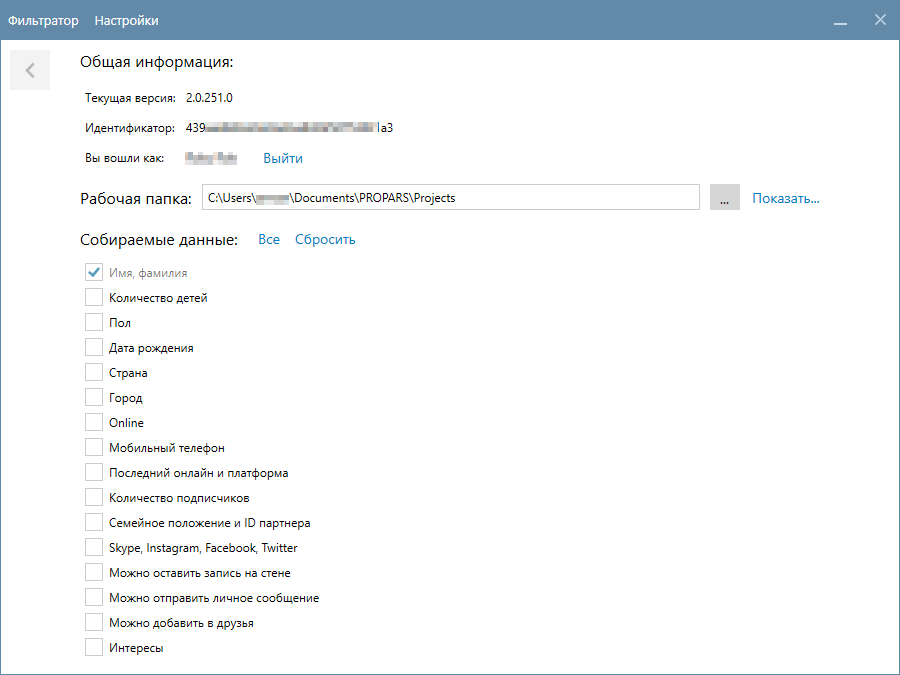

# Парсер

На этой странице мы расскажем вам, как запустить и настроить Парсер. Пожалуйста, ознакомьтесь с дополнительной информацией о каждой функции, чтобы эффективно использовать возможности программы.

## Запуск программы

Для запуска Парсера, воспользуйтесь ярлыком `PROPARS` на рабочем столе. Этот ярлык создается автоматически в процессе установки программы.

Еще один способ запуска программы — через меню "Пуск". Просто откройте меню "Пуск" и введите в поисковой строке `PROPARS`.

??? example "Обновление программы"
    ### Обновление программы
    При запуске программа автоматически проводит проверку на наличие обновлений. При их наличии будет отображена история обновлений, чтобы вы могли ознакомиться c последними улучшениями в программе.

    

    После ознакомления с историей обновлений, нажмите кнопку "Обновить".


??? example "Активация программы"
    ### Активация программы

    При первом запуске программы вы увидите окно активации. 

    

    Для активации программы введите свой адрес электронной почты и нажмите кнопку `Активировать программу`. Если всё прошло хорошо, программа отобразит сообщение об успешной активации.

    

    Всё хорошо, теперь можно переходить к авторизации в программе.

??? example "Авторизация в программе"
    ### Авторизация

    После запуска вы увидите окно авторизации. Введите ваши логин и пароль от учетной записи VK. 

    ??? question "Для чего нужно авторизоваться в VK?"
        Для получения списка стран, городов, школ и прочих данных необходимо выполнить авторизацию, чтобы запросить эти данные у VK. Процедура авторизации осуществляется на официальном сайте VK.

    

---

<div id="settings"/>

## Настройка Парсера

Для доступа к настройкам Парсера, нажмите на кнопку `Настройки` в левом верхнем углу приложения. 



Окно настроек состоит из трех разделов: `Общая информация`, `Рабочая папка` и `Собираемые данные`.


### Общая информация

Здесь вы найдете информацию о версии программы, ваш идентификатор, а также имя учётной записи под которой вы авторизовались в VK.

!!! tip "Если вы хотите авторизоваться с использованием другой учетной записи VK - воспользуйтесь кнопкой `Выйти` справа от имени учетной записи."

`Идентификатор` (`ID`) может понадобиться при обращении в службу поддержки. Чтобы скопировать идентификатор, дважды щелкните по нему левой кнопкой мыши (чтобы выделить его), затем нажмите правую кнопку мыши и выберите `Копировать` в контекстном меню.

!!! danger "Рекомендуем не сообщать свой идентификатор третьим лицам, а сообщать его исключительно службе поддержки."

### Рабочая папка

В рабочую папку сохраняются ваши проекты. Дополнительную информацию о рабочей папке можно найти в [Глоссарии](./../index.md#termins). Нажав на ссылку `Показать...`, вы можете открыть рабочую папку в проводнике Windows.

<div id="user-fields"/>

### Собираемые данные

Данные, которые Парсер собирает о пользователях, зависят от выбранных параметров в опции `Собираемые данные`. Например, при выборе [Участники группы](./group-members.md) или любой другой функции, `Парсер` будет собирать только те данные, которые вы указали в настройках.

!!! tip "Скорость работы Парсера зависит от объема данных, которые он обрабатывает. Выбирайте только необходимые данные для достижения максимальной производительности."


<div id="txt-format"/>

## Поддерживаемый формат текстовых файлов

<div style="text-align: justify">
  <p>
    Для некоторых функций необходимо указывать входные данные (список пользователей, список сообществ) в текстовом файле с расширением <code>.txt</code>. Парсер поддерживает следующий формат записей:
  </p>
</div>

| Тип | Пример |
|  --- | --- |
| Ссылка| `https://vk.com/propars`, `https://vk.com/club52716852`, `https://vk.com/id1`|
| Короткое имя | `propars` |
| ID | `52716852`, `id1`, `club52716852` |

Каждая новая запись должна быть с новой строки, а расширение такого файла <code>.txt</code>.

```title="Пример содержимого файла"
https://vk.com/propars
https://vk.com/club52716852
https://vk.com/id1
propars
52716852
id1
club52716852
```