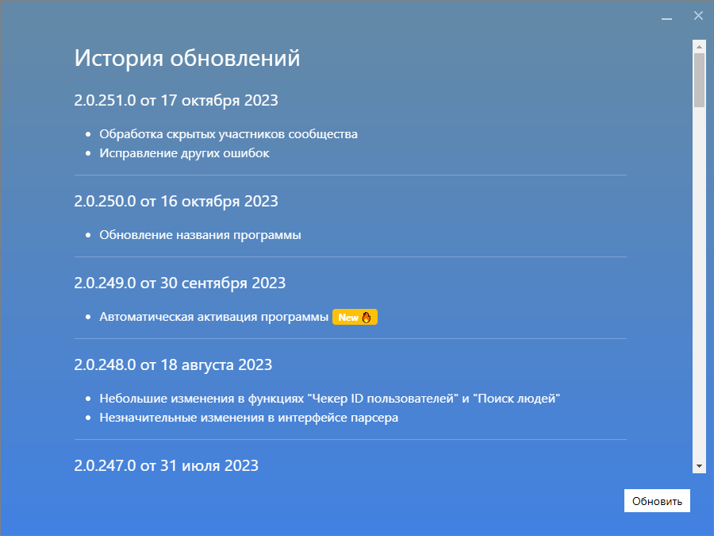
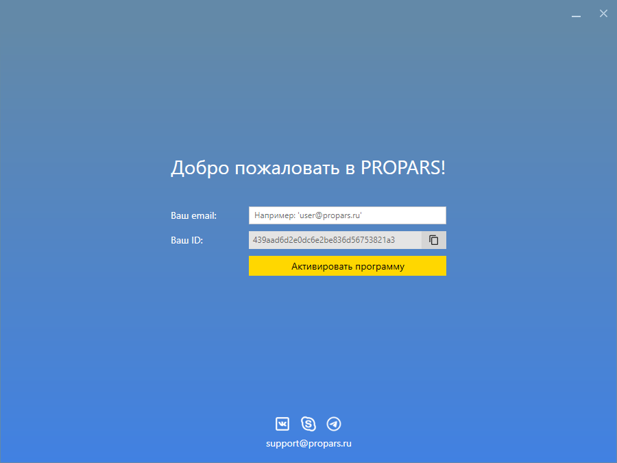
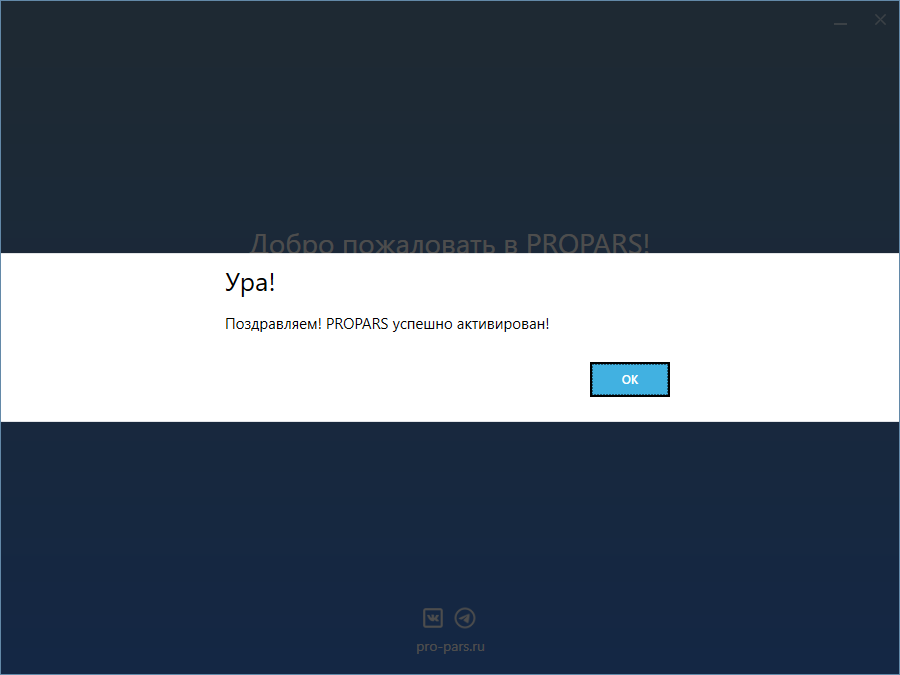
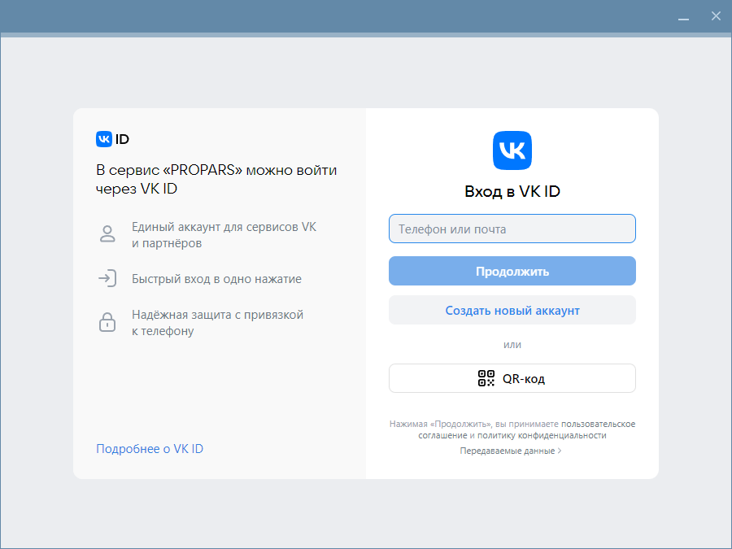

# Парсер

На этой странице мы расскажем вам, как запустить и настроить Парсер. Также здесь собрана информация о каждой из функций.

## Запуск программы

Чтобы запустить Парсер, воспользуйтесь ярлыком PROPARS на рабочем столе. Этот ярлык создается по умолчанию во время установки программы.

Также вы можете воспользоваться меню Пуск. Перейдите в меню Пуск и введите в поиске `PROPARS`.

??? example "Обновление программы"
    ### Обновление программы
    При запуске программа проверяет наличие обновлений. При их наличии будет отображена история обновлений, чтобы вы могли ознакомиться с нововведениями в программе.

    

    После того, как ознакомитесь с историей обновлений, нажмите кнопку "Обновить".

??? example "Активация программы"
    ### Активация программы

    При первом запуске программы вы увидите окно активации. 

    

    Чтобы активировать программу вам необходимо ввести свой адрес электронной почты и нажать на кнопку `Активировать программу`. Если всё прошло хорошо, программа отобразит сообщение об успешной активации.

    

    Всё хорошо, теперь можно переходить к авторизации в программе.

??? example "Авторизация в программе"
    ### Авторизация

    После запуска вы увидите окно авторизации. Введите ваши логин и пароль от учетной записи VK. 

    ??? question "Для чего нужно авторизоваться в VK?"
        Для загрузки списка стран, городов, школ, и прочих данных нам необходимо авторизоваться, чтобы получить эти данные от VK. Авторизация проходит на официальном сайте VK.

    

## Настройка Парсера

