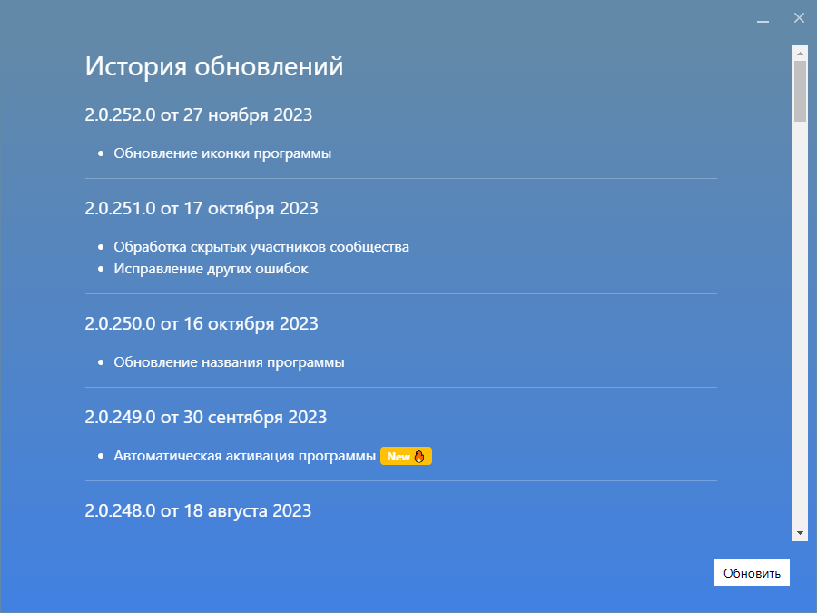

# Парсер

На этой странице мы расскажем вам, как запустить и настроить Парсер. Рекомендуем ознакомиться с дополнительной информацией о каждой функции для максимальной эффективного использования возможностей программы.

## Запуск программы

Для запуска Парсера, воспользуйтесь ярлыком `PROPARS` на рабочем столе (создается автоматически в процессе установки программы) либо поиском в меню "Пуск".

??? example "Обновление программы"
    ### Обновление программы
    При запуске программа автоматически проводит проверку на наличие обновлений. При их наличии будет отображена история обновлений для ознакомления c последними улучшениями.

    

    После ознакомления с историей обновлений, нажмите кнопку "Обновить".


??? example "Активация программы"
    ### Активация программы

    При первом запуске программы вы увидите окно активации. 

    

    Для активации программы введите свой email, затем нажмите кнопку `Активировать программу`. Если всё прошло хорошо, программа отобразит сообщение об успешной активации.

    

??? example "Авторизация в программе"
    ### Авторизация

    После успешной активации переходим к окну авторизации. Введите ваши логин и пароль от учетной записи ВКонтакте. 

    ??? question "Для чего нужно авторизоваться в VK?"
        Для доступа к спискам стран, городов, школ и других данных, вам необходимо авторизоваться. Также ваша учётная запись будет использована для выполнения некоторых заданий, которые вы запускаете. Процедура авторизации осуществляется на официальном сайте ВКонтакте.

    

---

<div id="settings"/>

## Настройка Парсера

Для доступа к настройкам Парсера, нажмите кнопку `Настройки` в левом верхнем углу приложения. 
Окно настроек состоит из трех разделов: `Общая информация`, `Рабочая папка` и `Собираемые данные`.


### Общая информация

Здесь вы найдете информацию о версии программы, ваш идентификатор, а также имя вашей учётной записи ВКонтакте.

!!! tip "Если вы хотите авторизоваться с использованием другой учетной записи ВКонтакте, воспользуйтесь кнопкой `Выйти` справа от имени учетной записи."

`Идентификатор` (`ID`) может понадобиться при обращении в службу поддержки.

!!! danger "Не передавайте свой идентификатор третьим лицам. Предоставляйте эту информацию исключительно службе поддержки."

### Рабочая папка

В рабочую папку сохраняются ваши проекты. Дополнительную информацию о рабочей папке можно найти в [Глоссарии](./../index.md#termins). Нажав на ссылку `Показать...`, вы можете открыть рабочую папку в проводнике Windows.

<div id="user-fields"/>

### Собираемые данные

Данные, которые Парсер собирает о пользователях, зависят от выбранных параметров в опции `Собираемые данные`. Например, при выборе [Участники группы](./group-members.md) или любой другой функции, `Парсер` будет собирать только те данные, которые вы указали в настройках.

!!! tip "Скорость работы Парсера зависит от объема данных, которые он обрабатывает. Выбирайте только необходимые данные для достижения максимальной производительности."


<div id="txt-format"/>

## Формат входных данных

<div style="text-align: justify">
  <p>
    Для запуска большинства функций необходимо указывать входные данные, такие как списки пользователей или сообществ. Эти данные можно ввести вручную или загрузить из текстового файла с расширением <code>.txt</code>.
  </p>
  <p>
    Парсер поддерживает следующий формат записей: 
  </p>
</div>

| Тип | Пример |
|  --- | --- |
| Ссылка | `https://vk.com/propars`, `https://vk.com/club52716852`, `https://vk.com/id1`|
| Короткое имя | `propars` |
| ID | `52716852`, `id1`, `club52716852` |

=== "Пример списка пользователей"
    ```title="Пример списка пользователей"
    https://vk.com/durov
    https://vk.com/id1
    durov
    1
    id1
    ```
=== "Пример списка сообществ"
    ```title="Пример списка сообществ"
    https://vk.com/propars
    https://vk.com/club52716852
    propars
    52716852
    club52716852
    ```
!!! info "Обратите внимание, что каждая новая запись должна начинаться с новой строки."

<div style="text-align: justify">
  <p>
    При загрузке списка пользователей в функцию, вы можете использовать текстовые файлы либо файлы специального формата <code>VKU</code>.
  </p>
</div>