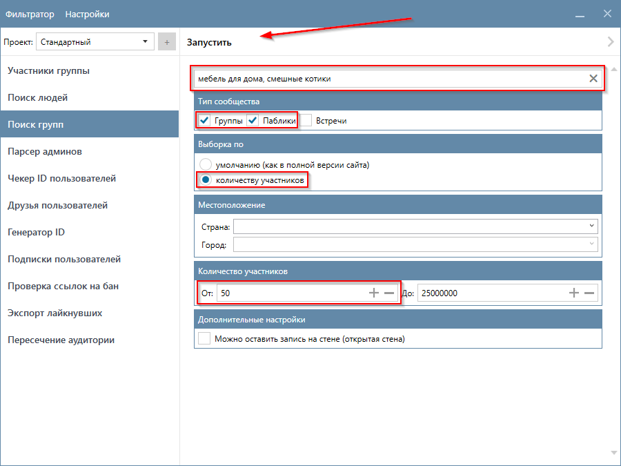
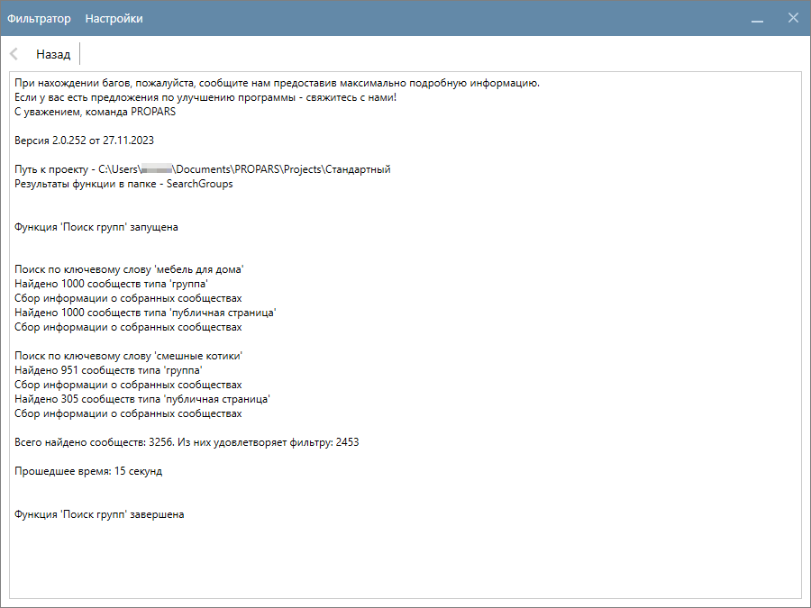
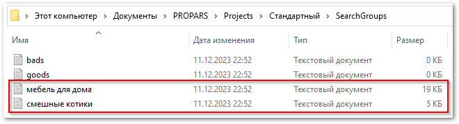
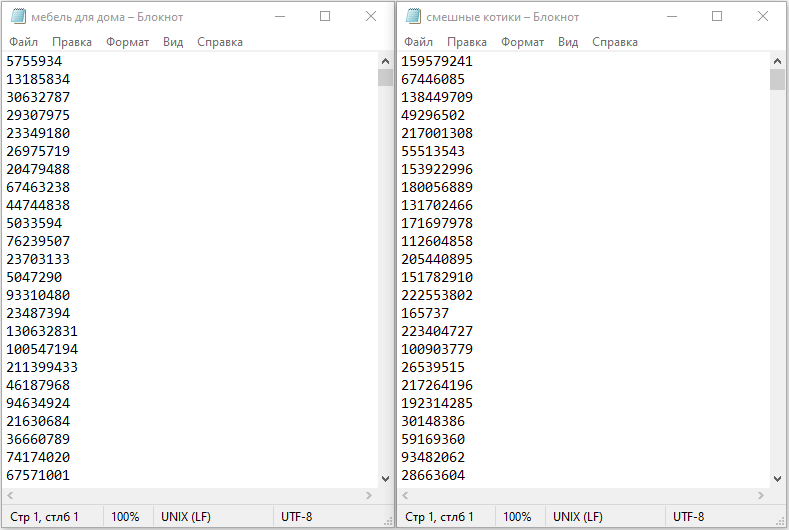

# Поиск групп

  

    Поиск групп — инструмент поиска тематических сообществ в VK по ключевым фразам. Функция умеет собирать <code>Группы</code>, <code>Паблики</code> и <code>Встречи</code>. По каждому из типов будет собрано до <code>1,000</code> сообществ по каждому ключевому слову. 
  

??? question "Какое максимальное количество сообществ можно найти?"
    Если выбрать все типы сообществ и ввести максимальное количество ключевых слов (за один запуск функции можно ввести до пяти ключевых слов), то можно найти `15,000` сообществ.

    |Количество ключевых слов|Выбранный тип сообщества|Количество найденных сообществ|
    |---|---|---|
    |Одно|Группы|до **1,000**|
    |Пять|Группы|до **5,000**|
    |Два|Паблики, Встречи|до **4,000**|
    |Одно|Группы, Паблики, Встречи|до **3,000**|
    |Два|Группы, Паблики, Встречи|до **6,000**|
    |Пять|Группы, Паблики, Встречи|до **15,000**|

    !!! question "Если ввести пять ключевых слов и выбрать все виды сообществ — я получу 15,000 сообществ?"
        Да, если вы не будете использовать другие фильтры, то с высокой долей вероятности вы получите примерно такое количество. Но всё зависит от того, с какими настройками вы запускаете функцию.

!!! tip "Нужны только предстоящие встречи? Укажите соответствующую опцию в настройках функции."

!!! tip "Собранные сообщества можно загрузить в функцию [Участники группы](./group-members.md)."

## Пример запуска функции

  

    Давайте найдем группы и паблики по ключевым словам <code>мебель для дома</code> и <code>смешные котики</code>, в которых более <code>50</code> участников. Перейдите на вкладку <code>Поиск групп</code> и укажите следующие настройки:

    <ul>
      <li>Ключевые слова — <code>мебель для дома, смешные котики</code>;</li>
      <li>Тип сообщества — <code>Группы</code> и <code>Паблики</code>;</li>
      <li>Выборка по — <code>количеству участников</code>;</li>
      <li>Количество участников — <code>от 50</code>.</li>
    </ul>
  

!!! note "Обратите внимание, что ключевые слова разделены запятой <code>,</code>."

  

    После указания настроек нажмите кнопку <code>Запустить</code> в верхней части окна Парсера.
  

  

    Парсер начнет искать сообщества по указанным ключевым словам и настройкам. В нашем примере это заняло <b>15</b> секунд. Было найдено <code>3,256</code> сообществ, но только <code>2,453</code> из них удовлятворяют указанным настройкам.
  

## Куда сохраняются результаты?

  

    Результаты сохраняются в <code>(Папка проекта)\SearchGroups</code> в текстовые файлы с расширением <code>.txt</code>. Имена файлов соответствуют ключевым словам. В нашем случае было создано два файла.
  

  

    Вы можете открыть файлы, чтобы ознакомиться с результатами.
  

---

## Настройки функции

!!! info "Таблица ссылается на скриншот выше."

<table>
  <thead>
    <tr style="background-color:rgb(241, 242, 244)">
      <th style="width:30%">Название</th>
      <th style="width:5%">№</th>
      <th style="width:65%">Описание</th>
    </tr>
  </thead>
  <tbody>
    <tr>
      <td>Ключевые слова</td>
      <td>1</td>
      <td>Ключевые слова, по которым нужно искать сообщества. Их можно разделить запятыми (<code>,</code>). Ограничение - не более пяти ключевых слов за один запуск функции.</td>
    </tr>
    <tr>
      <td>Тип сообщества</td>
      <td>2</td>
      <td><code>Группы</code>, <code>Паблики</code> и <code>Встречи</code>. Можно собирать только предстоящие <code>Встречи</code> выбрав флажок <code>Только предстоящие встречи</code></td>
    </tr>
    <tr>
      <td>Выборка по</td>
      <td>3</td>
      <td>То, в каком порядке мы будем собирать из VK сообщества.</td>
    </tr>
    <tr>
      <td>Страна</td>
      <td>4</td>
      <td>Страна, указанная в профиле сообщества. Список стран загружается из VK.</td>
    </tr>
    <tr>
      <td>Город</td>
      <td>5</td>
      <td>Город, указанный в профиле сообщества. Список стран загружается из VK.</td>
    </tr>
    <tr>
      <td>Количество участников</td>
      <td>6</td>
      <td>Диапазон количества участников сообщества.</td>
    </tr>
    <tr>
      <td>Можно оставить запись на стене</td>
      <td>7</td>
      <td>Только сообщества, у которых можно оставить запись на стене (открытая стена)</td>
    </tr>
  </tbody>
</table>

---

!!! success "Спасибо, что дочитали до конца. Остались вопросы? <a href="../../../support">Свяжитесь с нами!</a>"