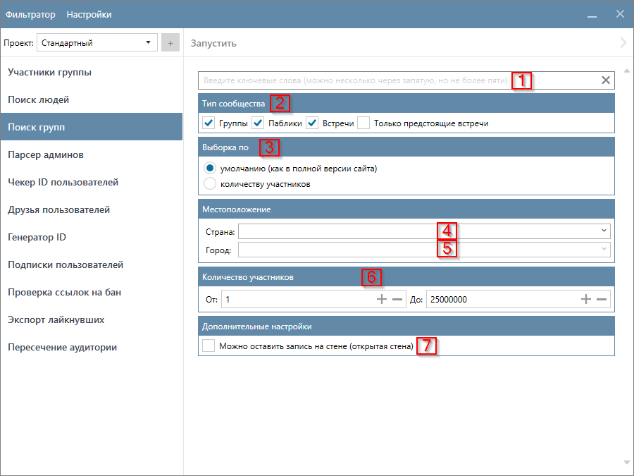

# Поиск групп

Поиск групп — инструмент поиска тематических сообществ в VK по фразам, содержащимся в их названии. Задавать ключевые слова можно в строке через запятую (ограничение: до 5 ключевых слов за один раз). Собранные сообщества вы потом можете загрузить в [Участники группы](./group-members.md).

## Интерфейс функции

## Настройки функции

!!! info "Таблица ссылается на скриншот из предыдущего раздела"

<table>
  <thead>
    <tr style="background-color:rgb(241, 242, 244)">
      <th style="width:30%">Название</th>
      <th style="width:5%">№</th>
      <th style="width:65%">Описание</th>
    </tr>
  </thead>
  <tbody>
    <tr>
      <td>Ключевые слова</td>
      <td>1</td>
      <td>Ключевые слова, по которым нужно искать сообщества. Их можно разделить запятыми (`,`), однако на данный момент установлено ограничение - не более пяти ключевых слов.</td>
    </tr>
    <tr>
      <td>Тип сообщества</td>
      <td>2</td>
      <td>`Группы`, `Паблики` и `Встречи`. Можно собирать только предстоящие `Встречи` выбрав флажок `Только предстоящие встречи`</td>
    </tr>
    <tr>
      <td>Выборка по</td>
      <td>3</td>
      <td>То, в каком порядке мы будем собирать из VK сообщества.</td>
    </tr>
    <tr>
      <td>Страна</td>
      <td>4</td>
      <td>Страна, указанная в профиле сообщества. Список стран загружается из VK.</td>
    </tr>
    <tr>
      <td>Город</td>
      <td>5</td>
      <td>Город, указанный в профиле сообщества. Список стран загружается из VK.</td>
    </tr>
    <tr>
      <td>Количество участников</td>
      <td>6</td>
      <td>Диапазон количества участников сообщества.</td>
    </tr>
    <tr>
      <td>Можно оставить запись на стене</td>
      <td>7</td>
      <td>Только сообщества, у которых можно оставить запись на стене (открытая стена)</td>
    </tr>
  </tbody>
</table>

## Ключевые слова и тип сообщества

Функция умеет собирать `Группы`, `Паблики` и `Встречи`. По каждому из типов будет собрано до `1,000` сообществ для по каждому ключевому слову. Таким образом, если выбрать все типы сообществ и ввести максимальное количество ключевых слов (на данный момент до 5), то на выходе можно получить `15,000` сообществ.

|Количество ключевых слов|Выбранный тип сообщества|Количество найденных сообществ|
|---|---|---|
|Одно|Группы|до **1,000**|
|Пять|Группы|до **5,000**|
|Два|Паблики, Встречи|до **4,000**|
|Одно|Группы, Паблики, Встречи|до **3,000**|
|Два|Группы, Паблики, Встречи|до **6,000**|
|Пять|Группы, Паблики, Встречи|до **15,000**|

??? question "Если ввести пять ключевых слов и выбрать все виды сообществ - на выходе я получу 15,000 сообществ?"
    Да, если вы не будете использовать другие фильтры, то с высокой долей вероятности вы получите примерно такое количество. Но всё зависит от того, с какими настройками вы запускаете функцию.

## Куда сохраняются результаты?

Результаты сохраняются в `(Папка проекта)\(SearchGroups)` в текстовые файлы с расширением `.txt`. Имена файлов соответствуют ключевым словам. Например, если вы запустите функцию со следующими ключевыми словами `мебель для дома, смешные котики`, то результаты будут сохранены в следующие файлы:

- `мебель для дома.txt`
- `смешные котики.txt`

!!! success "Спасибо, что дочитали до конца. Остались вопросы? Напишите нам!"