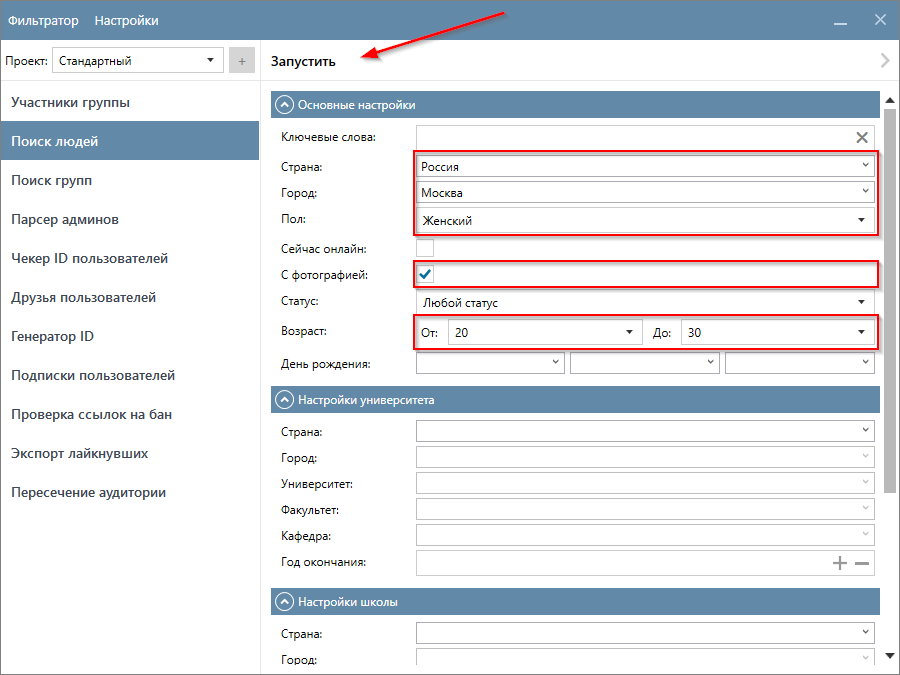
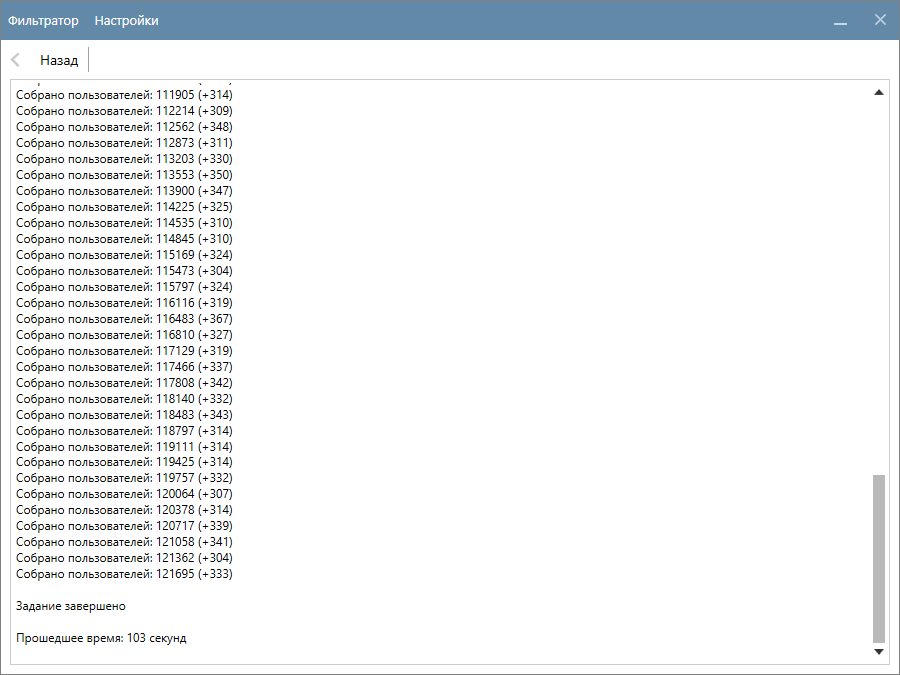
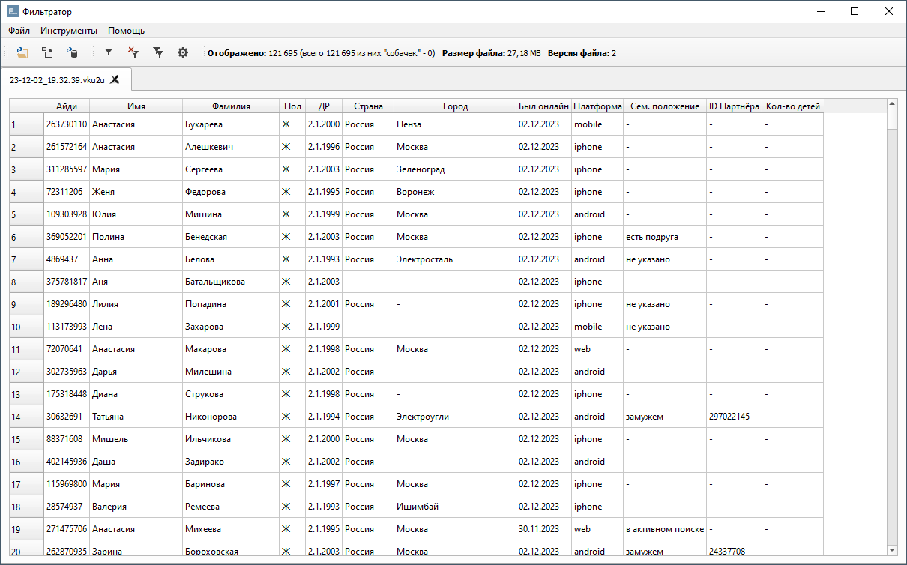

# Поиск людей

  

    Эта функция позволяет собирать информацию о людях из глобального поиска с учетом заданных критериев, преодолевая ограничение в 1000 пользователей.
  

!!! info "В глобальном поиске VK установлено ограничение в 1000 пользователей. PROPARS обходит это ограничение путём перебора даты рождения (дня и месяца). Если в критериях поиска вы указали день и/или месяц рождения – это может сократить количество пользователей, которых найдет программа."

??? question "Какие данные о пользователях собирает функция?"
    Это зависит от ваших настроек. Ознакомьтесь с разделом [Настройка Парсера](./index.md#settings).

## Пример запуска функции

  

    В этом примере мы ищем пользователей из Москвы в возрасте от 20 до 30 лет, у которых в профиле установлена фотография. Перейдите в функцию <code>Поиск людей</code> и укажите соответствующие параметры, как указано на скриншоте ниже, и нажмите кнопку <code>Запустить</code> в верхней части окна программы.
  

Начнётся процесс поиска людей, который займёт некоторое время.

## Куда сохраняются результаты?

  

    Результаты сохраняются в <code>(Папка проекта)\(SearchUsers)</code>, а имя файла формируется на основе текущей даты и времени на вашем компьютере. В нашем случае имя файла <code>23-12-01_13.22.13.vku2u</code>, формат файла - <code>VKU</code>. Двойным кликом левой кнопкой файл откроется в Фильтраторе.
  

---

!!! info "Более подробная информация о функции представлена ниже."

## Доступные критерии поиска

### Основные настройки

<table style="width:100%">
  <thead>
    <tr style="background-color:rgb(241, 242, 244)">
      <th style="width:20%">Название</th>
      <th style="width:30%">Тип элемента управления</th>
      <th style="width:50%">Описание</th>
    </tr>
  </thead>
  <tbody>
    <tr>
      <td>Ключевые слова</td>
      <td>Поле ввода с кнопкой очистить</td>
      <td>Строка поискового запроса. Например, <code>Вася Бабич</code>. Поиск ключевых слов происходит не только в имени и фамилии, но в профиле пользователя в целом.</td>
    </tr>
    <tr>
      <td>Страна</td>
      <td>Редактируемый выпадающий список</td>
      <td>Страна, указанная у пользователя. Список стран загружается из VK.</td>
    </tr>
    <tr>
      <td>Город</td>
      <td>Редактируемый выпадающий список</td>
      <td>Город, указанный у пользователя. Список городов загружается из VK после выбора Страны. По умолчанию загружаются наиболее крупные и популярные города. Поиск среди остальных городов происходит по мере ввода в это поле первых букв названия города.</td>
    </tr>
    <tr>
      <td>Пол</td>
      <td>Выпадающий список</td>
      <td>Если пол не выбран, то в результатах могут быть как мужчины, так и женщины. По умолчанию пол не выбран.</td>
    </tr>
    <tr>
      <td>Сейчас онлайн</td>
      <td>Чекбокс</td>
      <td>Пользователь в момент поиска должен быть в сети</td>
    </tr>
    <tr>
      <td>С фотографией</td>
      <td>Чекбокс</td>
      <td>У пользователя установлена заглавная фотография</td>
    </tr>
    <tr>
      <td>Статус</td>
      <td>Выпадающий список</td>
      <td>Семейное положение указанное в профиле</td>
    </tr>
    <tr>
      <td>Возраст (от, до)</td>
      <td>Два выпадающих списка</td>
      <td>Диапазон возраста пользователя. По умолчанию любой, в выпадающих списках выбрано значение “- Не важно -”.</td>
    </tr>
    <tr>
      <td>День рождения (день, месяц, год)</td>
      <td>Три выпадающих списка</td>
      <td>Отдельно можно задать день, месяц и год рождения. Данный критерий влияет на итоговое количество найденных программой пользователей. Подробнее см. Обход лимита VK в 1000 пользователей</td>
    </tr>
  </tbody>
</table>

### Настройки университета

<table style="width:100%">
  <thead>
    <tr style="background-color:rgb(241, 242, 244)">
      <th style="width:20%">Название</th>
      <th style="width:30%">Тип элемента управления</th>
      <th style="width:50%">Описание</th>
    </tr>
  </thead>
  <tbody>
    <tr>
      <td>Ключевые слова</td>
      <td>Поле ввода с кнопкой очистить</td>
      <td>Строка поискового запроса. Например, Вася Бабич. Поиск ключевых слов происходит не только в имени и фамилии, но в профиле пользователя в целом.</td>
    </tr>
    <tr>
      <td>Ключевые слова</td>
      <td>Поле ввода с кнопкой очистить</td>
      <td>Строка поискового запроса. Например, Вася Бабич. Поиск ключевых слов происходит не только в имени и фамилии, но в профиле пользователя в целом.</td>
    </tr>
    <tr>
      <td>Ключевые слова</td>
      <td>Поле ввода с кнопкой очистить</td>
      <td>Строка поискового запроса. Например, Вася Бабич. Поиск ключевых слов происходит не только в имени и фамилии, но в профиле пользователя в целом.</td>
    </tr>
    <tr>
      <td>Ключевые слова</td>
      <td>Поле ввода с кнопкой очистить</td>
      <td>Строка поискового запроса. Например, Вася Бабич. Поиск ключевых слов происходит не только в имени и фамилии, но в профиле пользователя в целом.</td>
    </tr>
    <tr>
      <td>Ключевые слова</td>
      <td>Поле ввода с кнопкой очистить</td>
      <td>Строка поискового запроса. Например, Вася Бабич. Поиск ключевых слов происходит не только в имени и фамилии, но в профиле пользователя в целом.</td>
    </tr>
  </tbody>
</table>
      

### Настройки школы

<table style="width:100%">
  <thead>
    <tr style="background-color:rgb(241, 242, 244)">
      <th style="width:20%">Название</th>
      <th style="width:30%">Тип элемента управления</th>
      <th style="width:50%">Описание</th>
    </tr>
  </thead>
  <tbody>
    <tr>
      <td>Страна</td>
      <td>Редактируемый выпадающий список</td>
      <td>См. описание “Страна” в разделе “Основные настройки”</td>
    </tr>
    <tr>
      <td>Город</td>
      <td>Редактируемый выпадающий список</td>
      <td>См. описание “Город” в разделе “Основные настройки”</td>
    </tr>
    <tr>
      <td>Школа</td>
      <td>Редактируемый выпадающий список</td>
      <td>Школа, которая указана у пользователя в профиле. Список школ загружается для выбранной страны и города из ВК. По умолчанию загружаются наиболее популярные школы. Поиск среди остальных школ происходит по мере ввода в это поле первых символов названия школы.</td>
    </tr>
    <tr>
      <td>Класс</td>
      <td>Буква класса, который указан у пользователя в профиле. Пользователь может ввести в это поле своё значение или выбрать его из списка.</td>
      <td>Строка поискового запроса. Например, Вася Бабич. Поиск ключевых слов происходит не только в имени и фамилии, но в профиле пользователя в целом.</td>
    </tr>
    <tr>
      <td>Год окончания</td>
      <td>Поле ввода, принимает значения от 1900 и до 2100.</td>
      <td>Год окончания школы, указанный в профиле у пользователя.</td>
    </tr>
  </tbody>
</table>

### Дополнительные настройки

<table style="width:100%">
  <thead>
    <tr style="background-color:rgb(241, 242, 244)">
      <th style="width:20%">Название</th>
      <th style="width:30%">Тип элемента управления</th>
      <th style="width:50%">Описание</th>
    </tr>
  </thead>
  <tbody>
    <tr>
      <td>Работа</td>
      <td>Поле ввода с кнопкой очистить.</td>
      <td>Строка поискового запроса. Например, Вася Бабич. Поиск ключевых слов происходит не только в имени и фамилии, но в профиле пользователя в целом.</td>
    </tr>
    <tr>
      <td>Должность</td>
      <td>Название компании, в которой работают пользователи.</td>
      <td>Строка поискового запроса. Например, Вася Бабич. Поиск ключевых слов происходит не только в имени и фамилии, но в профиле пользователя в целом.</td>
    </tr>
    <tr>
      <td>Религиозные взгляды</td>
      <td>Редактируемый выпадающий список</td>
      <td>Религиозные взгляды. В списке присутствуют популярные значения, однако пользователь может ввести и своё значение.</td>
    </tr>
  </tbody>
</table>

!!! success "Спасибо, что дочитали до конца. Остались вопросы? Напишите нам!"
