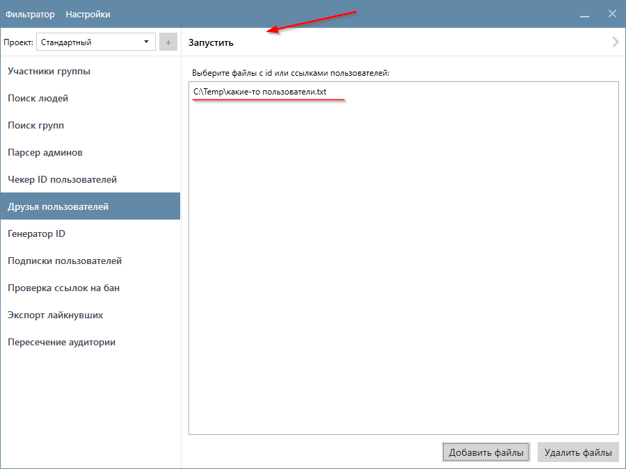
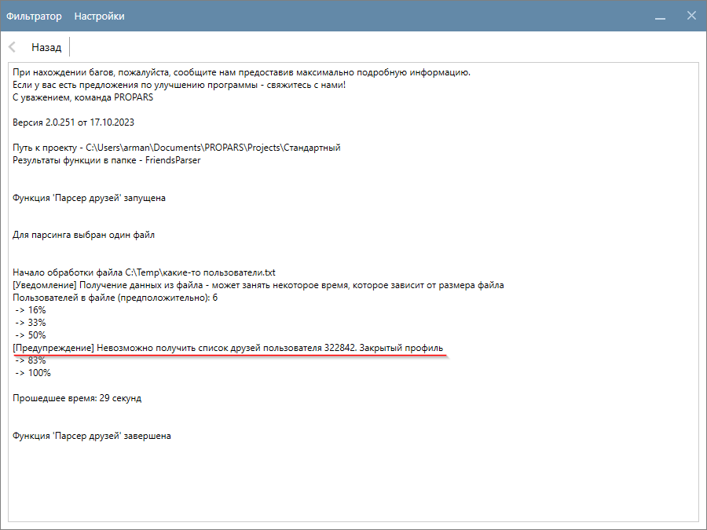
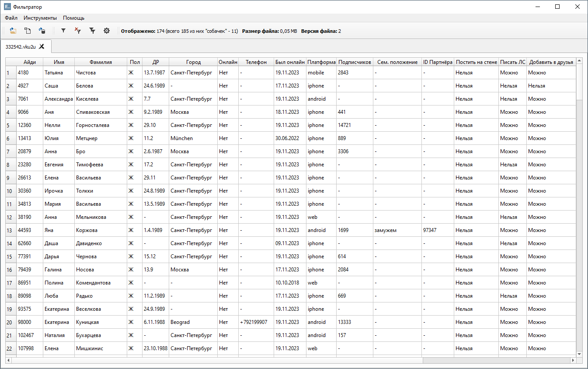

# Друзья пользователей

<div style="text-align: justify">
  <p>
    Данная функция предназначена для сбора информации о друзьях интересующих вас пользователей. Пользователи загружаются из выбранных файлов. Поддерживаемые форматы файлов: <code>.txt</code>, <code>.vku2u</code>.
  </p>

  <p>
  </p>
</div>

??? question "Какие данные о пользователях собирает функция?"
    Это зависит от ваших настроек. Ознакомьтесь с разделом [Настройка Парсера](./index.md#settings).

## Пример запуска функции

<div style="text-align: justify">
  <p>
    Выберите файл(ы) с пользователями, чьих друзей вы хотите собрать. Допускаются как файлы формата <code>.txt</code>, так и файлы формата <code>.vku2u</code>. В этом примере мы будем использовать первый вариант.  
  </p>

    ```title="Содержимое текстового файла"
    194471
    332542
    517390
    322842
    614736
    916700
    ```

    <p>
      Перейдите на вкладку "Друзья пользователей", выберите файл с нужными пользователями и нажмите кнопку "Запустить", как показано на скриншоте ниже.
    </p>
</div>



<div style="text-align: justify">
  <p>
    Программа начнёт собирать друзей пользователей. 
  </p>
</div>

!!! info "Если профиль пользователя закрыт, то собрать его друзей не получится. Об этом программа выведет предупреждение."



## Куда сохраняются результаты?

<div style="text-align: justify">
  <p>
    Результаты сохраняются в <code>(Папка проекта)\(FriendsParser)</code>. Друзья каждого пользователя сохраняются в отдельный файл нашего формата <code>VKU2U</code>. 
  </p>
</div>

!!! info "В примере выше мы выбрали шесть пользователей, у одного из которых закрытый профиль. Поэтому на выходе мы получим пять файлов с друзьями пользователей."

```title="Файлы с результатами. Имя файла соответствует идентификатору пользователя"
194471.vku2u
332542.vku2u
517390.vku2u
614736.vku2u
916700.vku2u
```

<div style="text-align: justify">
  <p>Ознакомиться с результатами вы можете с помощью `Фильтратора`.</p>
</div>





!!! success "Спасибо, что дочитали до конца. Остались вопросы? <a href="../../../support">Свяжитесь с нами!</a>"
