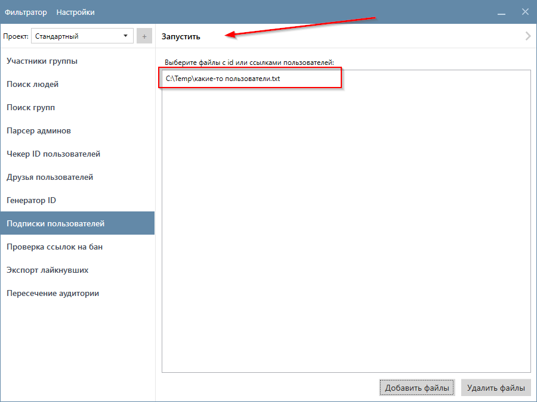
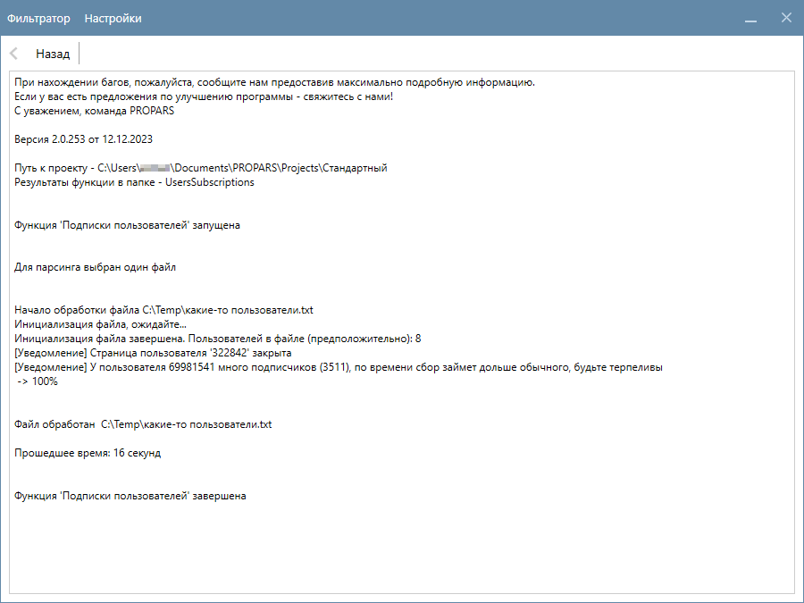
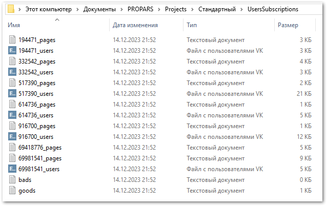
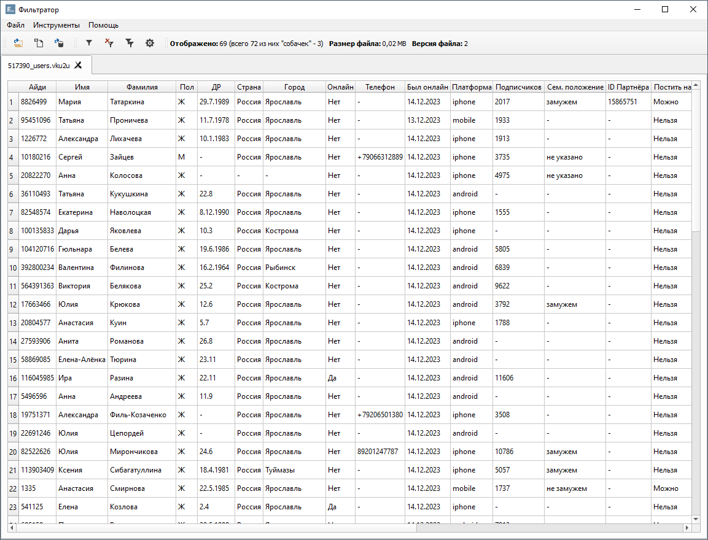
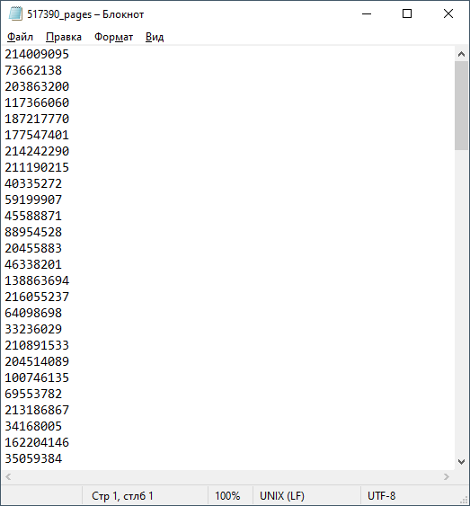

# Подписки пользователей

  

  Функция собирает информацию о подписках пользователей, включая других пользователей и публичные страницы, на которые указанные вами пользователи подписаны.
  

??? question "Какие данные о пользователях собирает функция?"
    Это зависит от ваших настроек. Ознакомьтесь с разделом [Настройка Парсера](./index.md#settings).

## Пример запуска функции

  

    Список пользователей, чьи подписки необходимо собрать, загружаются из файлов. Поддерживаются текстовые файлы с расширением <code>.txt</code> и файлы формата <code>VKU</code>. Подробнее о формате входных данных <a href="../#txt-format">вы можете прочитать здесь</a>.
  

  

    Перейдите во вкладку <code>Подписки пользователей</code>, выберите файл(ы) с нужными пользователями и нажмите кнопку <code>Запустить</code>.
  

  

    Парсер начнет собирать информацию о подписках указанных вами пользователей. В нашем примере процесс занял 16 секунд.
  

!!! info "Если профиль пользователя закрыт, программа выдаст предупреждение, и информация о подписках данного пользователя не будет собрана."

## Куда сохраняются результаты?

  

    Результаты сохраняются в <code>(Папка проекта)\(SubscriptionsParser)</code>. Информация о подписках каждого пользователя сохраняется в отдельный файл: 
    <ul>
      <li>пользователи в файл с именем <code>&lt;ID_пользователя&gt;_users</code> формата <code>VKU</code>;</li>
      <li>публичные страницы в текстовый файл с именем <code>&lt;ID_пользователя&gt;_pages</code>.</li>
    </ul>
  

!!! info "Вместо <code>&lt;ID_пользователя&gt;</code> — ID соответствующего пользователя. Если у пользователя нет подписок или его профиль закрыт, то для такого пользователя файлы не будут созданы. Возможно создание только одного файла для пользователя в том случае, если у него в подписках только пользователи или только публичные страницы."

  

    Откройте файл с результатами в Фильтраторе.
  

=== "Файл с пользователями"
    

      

        
      

    

    

=== "Файл с публичными страницами"
    

      

        Файл с публичными страницами будет открыт в текстовом редакторе.
      

    

    

!!! success "Спасибо, что дочитали до конца. Остались вопросы? <a href="../../../support">Свяжитесь с нами!</a>"
