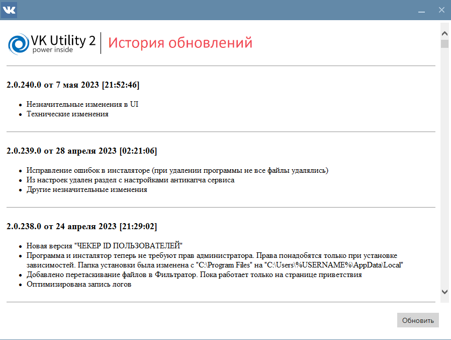
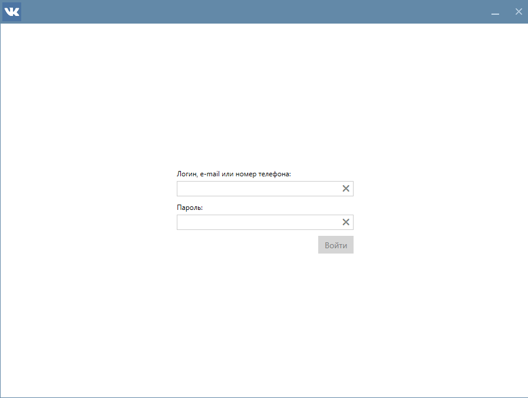

#

## Запуск программы и проверка обновлений
При запуске программа всегда проверяет наличие обновление. Если такие имеются, то будет отображена история обновлений, чтобы вы могли ознакомиться с изменениями. Нажмите кнопку `Обновить` чтобы скачать и установить обновление. Во время процесса обновления программа может перезапуститься.

## Авторизация в программе
После запуска вы увидете окно авторизации. Введите ваши логин и пароль от учетной записи VK. 
???+ question "Для чего используется моя учетная запись VK?"
    Для загрузски списка стран, городов, школ, и прочих данных нам необходимо авторизоваться, чтобы получить эти данные от VK. Также учётная запись будет использована для выполнения некоторых заданий которые вы запускаете.

    **Мы гарантируем, что не храним и не передаём ваши учетные данные третьим лицам.**

    Однако, для вашего спокойствия мы рекомендуем вам использовать "левые" учётные записи.

