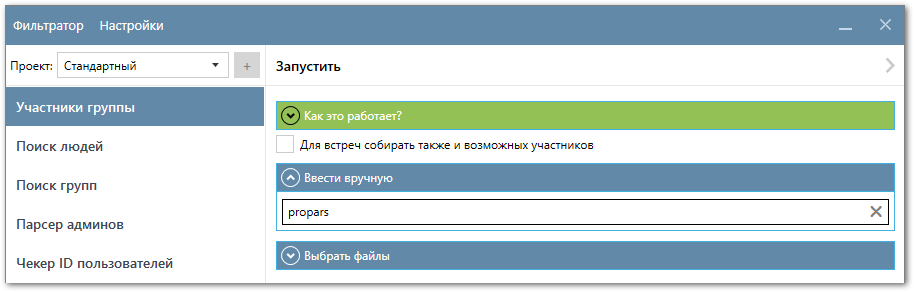
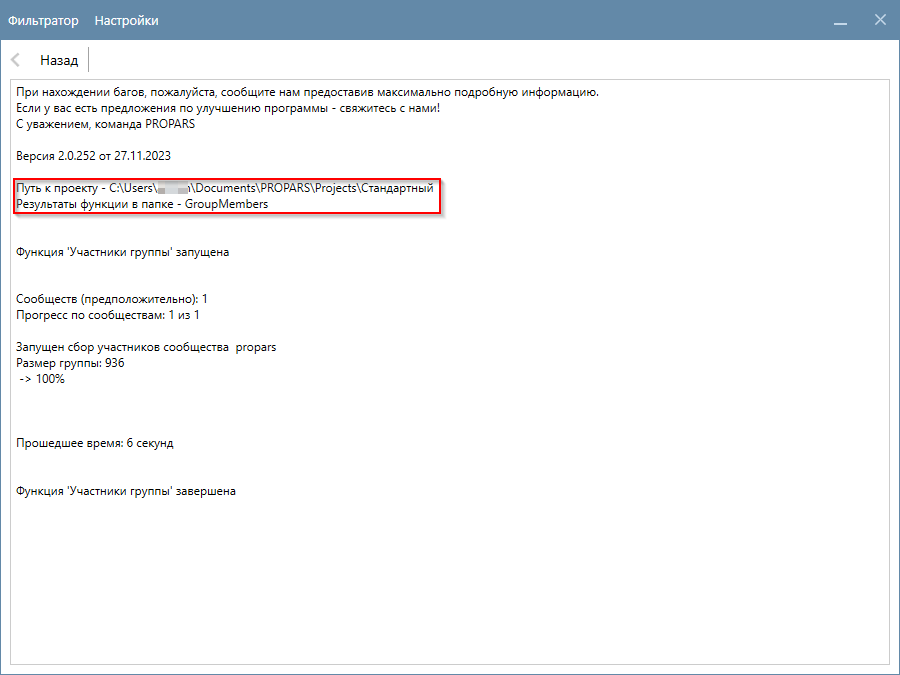
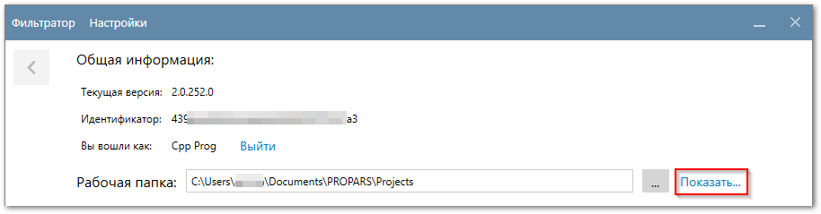
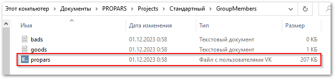
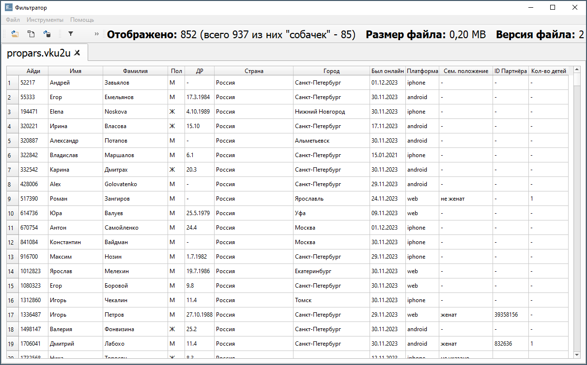
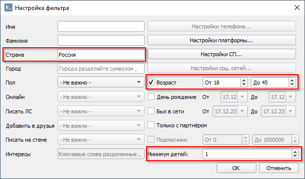
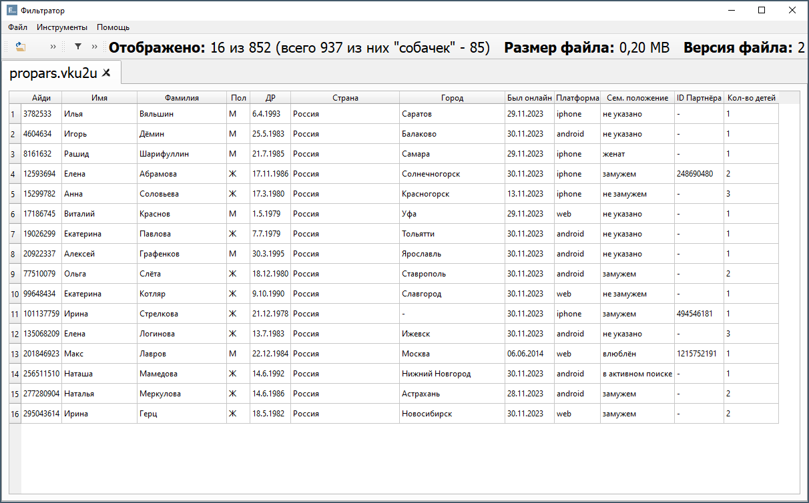
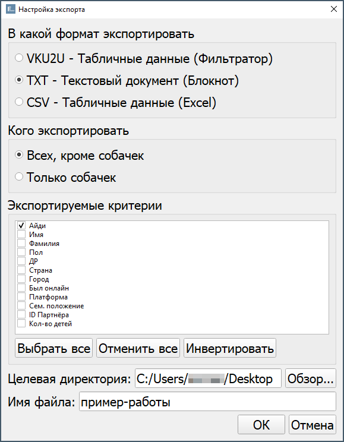
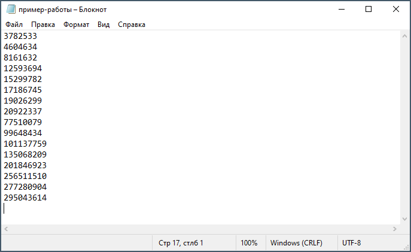

  

    В этом разделе мы расскажем, как запустить ваше первое задание. Давайте соберем участников группы, а затем отфильтруем их по нужным критериям! 💪
  

  

    <!-- Поехали. 💪 -->
  

---

  
  
    Запускаем <code>PROPARS</code> и переходим в <code>Настройки</code>. В Настройках укажем, какие данные мы хотим собирать о пользователях. После этого нажимаем кнопку <code>Назад</code>.
  

  
  
  Убедитесь, что в боковом меню у вас выбрана функция <code>Участники группы</code>. Введём короткое имя группы в окно "Ввести вручную" и запустим задание, нажав кнопку <code>Запустить</code>.
  

  
  
    Начнется сбор данных, и программа покажет, куда сохранятся результаты.
  

  
  
    После завершения сбора данных, откроем папку с результатами. Вы можете найти рабочую папку самостоятельно либо нажать на кнопку <code>Показать...</code> в настройках программы.
  

  
  
    Найдем результаты работы функции. Название файла – это короткое имя группы, которую мы собирали. В нашем случае <code>propars</code>.
  

  

    Откроем файл в Фильтраторе двойным кликом.
  

  
  
    Как видите, все участники группы представлены в таблице. Давайте отфильтруем результаты и оставим только пользователей из России, в возрасте от 18 до 45 лет, у которых есть минимум 1 ребенок. Для этого откроем окно <code>Настройки фильтра</code> с помощью горячих клавиш <kbd>Ctrl</kbd> + <kbd>F</kbd> либо через меню приложения <code>Инструменты -> Установить фильтр</code> и введем нужные параметры, как указано на картинке.
  

  
  
    После применения фильтра в окне программы отображаются только те пользователи, которые удовлетворяют фильтру.
  

  
  
    Давайте сохраним ID этих пользователей в текстовый файл. Для этого можно нажать <kbd>Ctrl</kbd> + <kbd>S</kbd> либо воспользоваться меню приложения <code>Файл -> Экспортировать</code>.
  

  
  
    Выбираем формат <code>TXT</code>, экспортирумые критерии <code>Айди</code>, директорию, в которую вы хотите сохранить результаты, имя файла и нажимаем <code>OK</code>. Программа отобразит фильтр, который вы применили, чтобы вы могли убедиться в его корректности. Снова нажимаем <code>ОК</code>.
  

  
  
    Всё готово! Мы собрали участников группы, а затем отфильтровали их, оставив только тех пользователей, которые нам нужны. Теперь вы можете использовать сохраненный файл для загрузки ID пользователей в рекламный кабинет ВКонтакте.
  

---

!!! success "Спасибо, что дочитали до конца! Остались вопросы? [Свяжитесь с нами](../support.md)."
    Чтобы получить больше информации о PROPARS, ознакомьтесь с нашим [Руководством пользователя](../docs/index.md).
