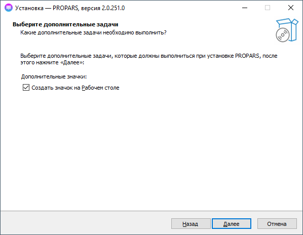

# Установка программы

## Требования к системе
- 64-битная версия Windwos 7 и выше
- Минимум 2 ГБ оперативной памяти
- Доступ в интернет

Также вам потребуется учетная запись VK с отключенной 2FA (двухфакторной аутентификацией) для входа в программу.

## Процесс установки
Для наиболее быстрого и простого процесса установки мы создали установщик, который устанавливает `VK Utility`, а также при необходимости некоторые зависимости. [^1]

Скачайте установщик [по ссылке](https://soft-issue.com/vku2-version/setups/VKUtility2-setup.exe) и запустите его. После запуска вы можете столкнуться с предупреждением от `Windows Smart Screen`.

По скольку у нашей программы пока нет цифровой подписи, `Windows Smart Screen` блокирует её запуск. Нажмите в окне на ссылку `Подробнее`, а далее на кнопку `Выполнить в любом случае` как показано на картинке ниже.

После выше указанных действий, у вас запустится установщик. На первом шаге вам необходимо выбрать папку, в которую программа будет установлена.

Далее название для папки программы в меню `Пуск`.

Настройки создания ярлыка на рабочем столе (программа создаёт только один ярлык).

На последнем шаге установщик ознакомит вас с выбранными опциями.

После завершения установки вы можете запустить программу прямо из установщика.

**Поздравляем!** VK Utility был успешно установлен на ваш компьютер.

## Что дальше?
Вы в одном шаге, чтобы начать пользоваться программой.

Перейдите к разделу [Первый запуск](./first-launch.md) чтобы узнать как пользоваться программой.

[^1]: Для корректной работы программы требуются `Microsoft .NET Framework 4.8` и `Microsoft Visual C++ Redistributable x64`. Как правило данные пакеты установлены у вас по умолчанию, но бывают и исключения.