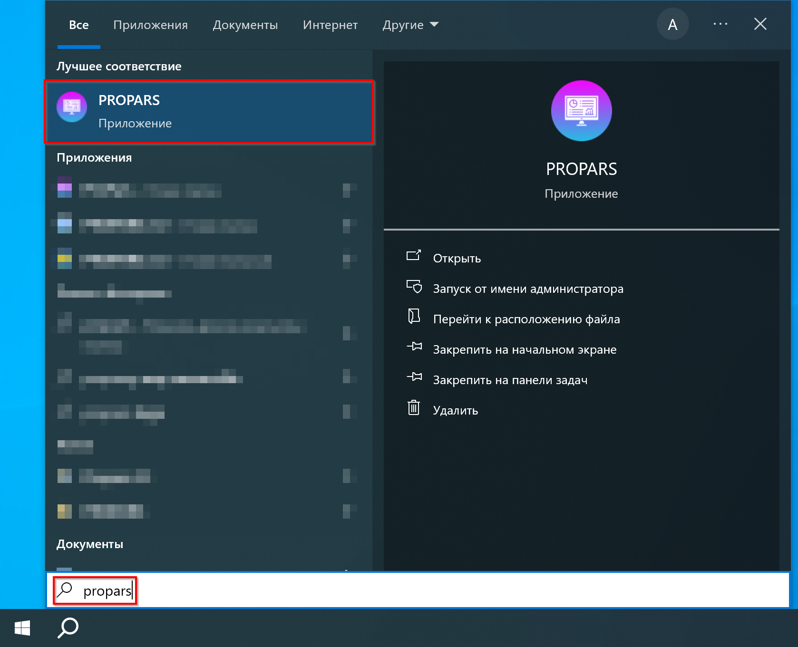
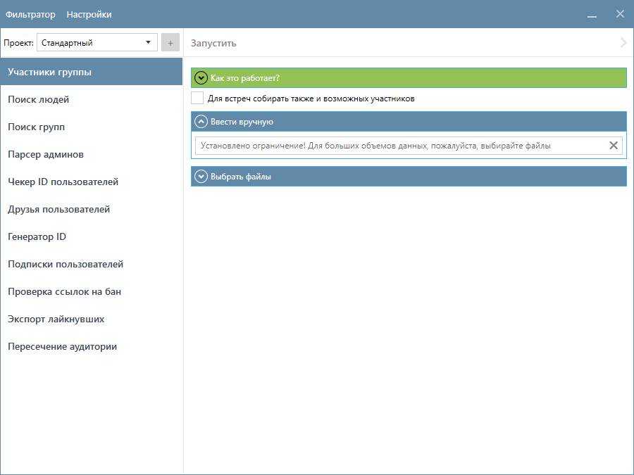

  
Сейчас мы поможем вам установить и активировать PROPARS.

  
<b>Не переживайте!</b> Это займет не более 🕛 3 минут! Готовы?

## Установка PROPARS

  
Для наиболее быстрого и простого процесса установки мы создали установщик, который установит <code>PROPARS</code> на ваш компьютер. Скачайте и запустите его.

[:fontawesome-solid-download: Скачать установщик PROPARS :fontawesome-solid-download:](https://soft-issue.com/vku2-version/setups/propars-setup.exe){ .md-button }

??? question "Что делать, если не запускается установщик?"
    После запуска вы можете столкнуться с предупреждением от `Windows Smart Screen`.

    

    По скольку у нашей программы пока нет цифровой подписи, `Windows Smart Screen` блокирует её запуск. Нажмите в окне на ссылку `Подробнее`, а далее на кнопку `Выполнить в любом случае` как показано на картинке ниже.

    

После выше указанных действий, у вас запустится установщик. На первом шаге вам необходимо выбрать папку, в которую программа будет установлена.

Далее название для папки программы в меню `Пуск`.

  Настройки создания ярлыка на рабочем столе (программа создаёт только один ярлык). Рекомендуем создать ярлык на рабочем столе, чтобы у вас всегда была возможность быстро запустить <code>PROPARS</code>.

На последнем шаге установщик ознакомит вас с выбранными опциями.

После завершения установки вы можете запустить программу прямо из установщика.

  

    <b>Поздравляем!</b> PROPARS был успешно установлен на ваш компьютер!
  

## Запуск PROPARS

  

    Если на последнем шаге установки вы не снимали галочку <code>Запустить PROPARS</code>, то он запустится у вас по завершению установки.
    На Рабочем столе также был создан ярлык для быстрого запуска PROPARS, если вы не указали иное во время установки программы.
  

??? example "Ещё один способ запустить PROPARS – через меню Пуск. Откройте меню Пуск и напишите в поисковой строке `PROPARS`"
    

### Обновление программы

  

    При первом запуске вы увидите историю обновлений программы.
  

Ознакомтесь с ней и нажмите кнопку "Обновить".

### Активация программы

  

    Далее вы увидите окно активации PROPARS, так как вы запускаете программу впервые и ранее не активировали её.
  

  

    Для активации программы введите свой адрес электронной почты и нажмите кнопку <code>Активировать программу</code>. Если всё прошло хорошо, программа отобразит сообщение об успешной активации.
  

  

    Всё хорошо, теперь можно переходить к авторизации!
  

### Авторизация

Последний шаг, перед тем как начать пользоваться PROPARS - это авторизация в VK. 

??? question "Для чего нужно авторизоваться в VK?"
    Для получения списка стран, городов, школ и прочих данных необходимо выполнить авторизацию, чтобы запросить эти данные у VK. Процедура авторизации осуществляется на официальном сайте VK.

После того как авторизация пройдена - вы увидите главное окно PROPARS.

  

    <b>Поздравляем!</b> Вы готовы к тому, чтобы запустить ваше первое задание. Сделаем это в следующем разделе!
  

