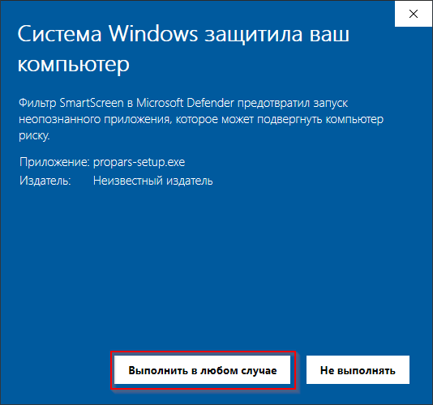

  
Для наиболее быстрого и простого процесса установки мы создали установщик, который установит <code>PROPARS</code> на ваш компьютер. Скачайте и запустите его.

[:fontawesome-solid-download: Скачать установщик PROPARS :fontawesome-solid-download:](https://soft-issue.com/vku2-version/setups/propars-setup.exe){ .md-button }

??? question "Что делать, если не запускается установщик?"
    После запуска вы можете столкнуться с предупреждением от `Windows Smart Screen`.

    

    По скольку у нашей программы пока нет цифровой подписи, `Windows Smart Screen` блокирует её запуск. Нажмите в окне на ссылку `Подробнее`, а далее на кнопку `Выполнить в любом случае` как показано на картинке ниже.

    

После выше указанных действий, у вас запустится установщик. На первом шаге вам необходимо выбрать папку, в которую программа будет установлена.

Далее название для папки программы в меню `Пуск`.

Настройки создания ярлыка на рабочем столе (программа создаёт только один ярлык).

На последнем шаге установщик ознакомит вас с выбранными опциями.

После завершения установки вы можете запустить программу прямо из установщика.

**Поздравляем!** PROPARS был успешно установлен на ваш компьютер.

---

## Что дальше?
Вы в одном шаге, чтобы начать пользоваться программой.

Перейдите к разделу [Первый запуск](./first-launch.md) чтобы узнать как пользоваться программой.