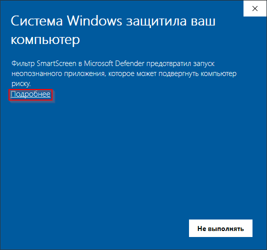
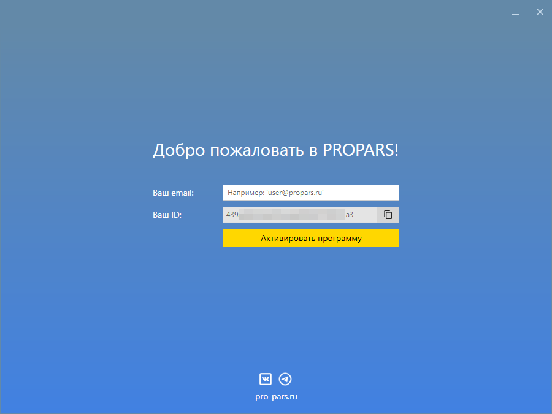

  
Сейчас мы поможем вам установить и активировать PROPARS.

  
<b>Не переживайте!</b> Это займет не более 3 минут! Готовы?

## Требования к системе

- 64-битная версия Windows 7 и выше
- Минимум 2 ГБ оперативной памяти
- Доступ в интернет

  

    Для наиболее быстрого и простого процесса установки скачайте установщик и запустите его.
  

[:fontawesome-solid-download: Скачать установщик PROPARS :fontawesome-solid-download:](https://soft-issue.com/vku2-version/setups/propars-setup.exe){ .md-button }

??? question "Что делать, если не запускается установщик?"
    

      

      После запуска вы можете столкнуться с предупреждением от <code>Windows Smart Screen</code>.
      

    

    

    

      

        Так как у нашей программы пока нет цифровой подписи, <code>Windows Smart Screen</code> блокирует её запуск. Нажмите в окне ссылку <code>Подробнее</code>, затем кнопку <code>Выполнить в любом случае</code>, как показано на картинке ниже.
      

    

    

  

    После выполнения вышеуказанных действий у вас запустится установщик. Теперь необходимо выбрать папку, в которую программа будет установлена.
  

Далее укажите название папки программы в меню `Пуск`.

  Затем создайте ярлык программы на рабочем столе.

На последнем шаге установщик ознакомит вас с выбранными опциями.

После завершения установки вы можете запустить программу прямо из установщика.

  

    <b>Поздравляем!</b> <code>PROPARS</code> был успешно установлен на ваш компьютер!
  

## Запуск PROPARS

  

    Если на последнем шаге установки вы не снимали галочку <code>Запустить PROPARS</code>, то программа запустится по завершению установки.
  

??? example "Также <code>PROPARS</code> можно запустить используя меню Пуск. Откройте меню Пуск и введите в поисковой строке `PROPARS`"
    

### Обновление программы

  

    При каждом запуске программы происходит автоматическая проверка наличия обновлений. Если обновления доступны, то вы сможете ознакомиться с историей изменений. 
  

  

    Нажмите кнопку <code>Обновить</code>, чтобы загрузить и установить последние изменения. Во время процесса обновления программа может перезапуститься.
  

### Активация программы

  

    При первом запуске программы вам необходимо ее активировать.
  

  

    Для активации программы введите свой email и нажмите кнопку <code>Активировать программу</code>. Если всё прошло хорошо, программа отобразит сообщение об успешной активации.
  

### Авторизация

  

    Завершающий шаг – это авторизация. Введите логин и пароль от вашей учетной записи ВКонтакте.
  

??? question "Для чего используется моя учетная запись ВКонтакте?"
    

      

        Для доступа к спискам стран, городов, школ и других данных, вам необходимо авторизоваться. Также ваша учётная запись будет использована для выполнения некоторых заданий, которые вы запускаете. Процедура авторизации осуществляется на официальном сайте ВКонтакте.
      

    

  

    После того как авторизация пройдена, вы увидите главное окно <code>PROPARS</code>.
  

  

    <b>Поздравляем!</b> Вы готовы к тому, чтобы запустить ваше первое задание. Сделаем это в следующем разделе!
  

